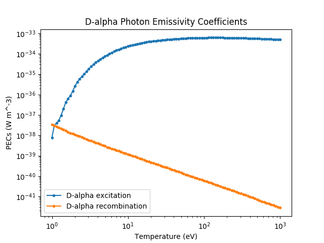

Rate Coefficients
-----------------

All atomic rate coefficients specify a calling signature that must be used for this rate,
e.g. `__call__(arg1, arg2, ...)`. The calculations associated with this calling signature
are actually implemented in a separate function called `evaluate(arg1, arg2, ...)`. No other
information or data about the rate is specified in the core API, instead all other
implementation details are deferred to the atomic data provider.

The reason for this design is that it allows rate objects to be used throughout all the
CHERAB emission models without knowing how this data will be provided or calculated.
For example, some atomic data providers might use interpolated data while others could
provide theoretical equations. CHERAB emission models only need to know how to call
them after they have been instantiated.

Photon Emissivity Coefficients
^^^^^^^^^^^^^^^^^^^^^^^^^^^^^^

.. autoclass:: cherab.core.atomic.rates.ImpactExcitationRate

.. autoclass:: cherab.core.atomic.rates.RecombinationRate

.. autoclass:: cherab.core.atomic.rates.ThermalCXRate

The PEC `ImpactExcitationRate`, `RecombinationRate` and `ThermalCXRate` classes all share
the same call signatures.

.. function:: __call__(density, temperature)

   Returns a photon emissivity coefficient at the specified plasma conditions.

   This function just wraps the cython evaluate() method.

.. function:: evaluate(density, temperature)

   Returns a photon emissivity coefficient at the specified plasma conditions.

   This function needs to be implemented by the atomic data provider.

   :param float temperature: Receiver ion temperature in eV.
   :param float density: Receiver ion density in m^-3
   :return: The effective PEC rate in W/m^3.

Some example code for requesting PEC objects and sampling them with the __call__()
method.

.. code-block:: pycon

   >>> import numpy as np
   >>> import matplotlib.pyplot as plt
   >>> from cherab.core.atomic import deuterium
   >>> from cherab.openadas import OpenADAS
   >>>
   >>> # initialise the atomic data provider
   >>> adas = OpenADAS()
   >>>
   >>> # request d-alpha instance of ImpactExcitationRate
   >>> dalpha_excit = adas.impact_excitation_rate(deuterium, 0, (3, 2))
   >>> # request d-alpha instance of RecombinationRate
   >>> dalpha_recom = adas.recombination_rate(deuterium, 0, (3, 2))
   >>>
   >>> # evaluate D-alpha ImpactExcitationRate PEC at n_e = 1E19 m^-3 and t_e = 2 eV
   >>> dalpha_excit(1E19, 2)
   2.503529003169861e-36
   >>>
   >>> # settings for plot range
   >>> temp_low = 1
   >>> temp_high = 1000
   >>> num_points = 100
   >>> electron_density = 1E19
   >>> electron_temperatures = [10**x for x in np.linspace(np.log10(temp_low), np.log10(temp_high), num=num_points)]
   >>>
   >>> # sample the PECs with __call__()
   >>> dalpha_excit_pecs = [dalpha_excit(electron_density, te) for te in electron_temperatures]
   >>> dalpha_recom_pecs = [dalpha_recom(electron_density, te) for te in electron_temperatures]
   >>>
   >>> # plot the PEC rates
   >>> plt.figure()
   >>> plt.loglog(electron_temperatures, dalpha_excit_pecs, '.-', label="D-alpha excitation")
   >>> plt.loglog(electron_temperatures, dalpha_recom_pecs, '.-', label="D-alpha recombination")
   >>> plt.xlabel("Temperature (eV)")
   >>> plt.ylabel("PECs (W m^-3)")
   >>> plt.legend()
   >>> plt.show()

   **Caption:** A plot of balmer D-alpha PEC coefficients generated by the above code snippet.

Beam-Plasma Interaction Rates
^^^^^^^^^^^^^^^^^^^^^^^^^^^^^

.. autoclass:: cherab.core.atomic.rates.BeamStoppingRate

.. autoclass:: cherab.core.atomic.rates.BeamPopulationRate

.. autoclass:: cherab.core.atomic.rates.BeamEmissionRate

The `BeamStoppingRate`, `BeamPopulationRate` and `BeamEmissionRate` classes all share
the same call signatures.

.. function:: __call__(energy, density, temperature)

   Returns the associated beam reaction rate at the specified plasma conditions.

   This function just wraps the cython evaluate() method.

.. function:: evaluate(energy, density, temperature)

   Returns the beam coefficient for the supplied parameters.

   :param float energy: Interaction energy in eV/amu.
   :param float density: Target electron density in m^-3
   :param float temperature: Target temperature in eV.
   :return: The beam coefficient

Some example code for requesting beam rate objects and sampling them with the __call__()
method.

.. code-block:: pycon

   >>> import numpy as np
   >>> import matplotlib
   >>> import matplotlib.pyplot as plt
   >>> from cherab.core.atomic import deuterium, carbon
   >>> from cherab.openadas import OpenADAS
   >>>
   >>> # Make Latex available in matplotlib figures
   >>> matplotlib.rcParams.update({'font.size': 12})
   >>> matplotlib.rc('text', usetex=True)
   >>> matplotlib.rc('font', **{'family': 'serif', 'serif': ['Computer Modern']})
   >>>
   >>> # initialise the atomic data provider
   >>> adas = OpenADAS(permit_extrapolation=True)
   >>>
   >>> # Request beam stopping rate and sample at three different electron temperatures
   >>> bms = adas.beam_stopping_rate(deuterium, carbon, 6)
   >>> beam_energies = [10**x for x in np.linspace(np.log10(5000), np.log10(125000), num=num_points)]
   >>> bms_rates_1 = [bms(x, 1E19, 1) for x in beam_energies]
   >>> bms_rates_2 = [bms(x, 1E19, 100) for x in beam_energies]
   >>> bms_rates_3 = [bms(x, 1E19, 1000) for x in beam_energies]
   >>>
   >>> # plot the beam stopping rates
   >>> plt.figure()
   >>> plt.semilogx(beam_energies, bms_rates_1, '.-', label=r'$t_e$ = 1eV')
   >>> plt.semilogx(beam_energies, bms_rates_2, '.-', label=r'$t_e$ = 100eV')
   >>> plt.semilogx(beam_energies, bms_rates_3, '.-', label=r'$t_e$ = 1000eV')
   >>> plt.xlabel("Interaction Energy (eV/amu)")
   >>> plt.ylabel(r"$S^{e, i}_{CR}$ ($m^3s^{-1}$)")
   >>> plt.title("Beam Stopping Rates")
   >>> plt.legend()
   >>>
   >>> # Sample the beam population rates
   >>> bmp = adas.beam_population_rate(deuterium, 2, carbon, 6)
   >>> bmp_rates_1 = [bmp(x, 1E19, 1) for x in beam_energies]
   >>> bmp_rates_2 = [bmp(x, 1E19, 100) for x in beam_energies]
   >>> bmp_rates_3 = [bmp(x, 1E19, 1000) for x in beam_energies]
   >>>
   >>> # plot the beam population rates
   >>> plt.figure()
   >>> plt.semilogx(beam_energies, bmp_rates_1, '.-', label=r'$t_e$ = 1eV')
   >>> plt.semilogx(beam_energies, bmp_rates_2, '.-', label=r'$t_e$ = 100eV')
   >>> plt.semilogx(beam_energies, bmp_rates_3, '.-', label=r'$t_e$ = 1000eV')
   >>> plt.xlabel("Interaction Energy (eV/amu)")
   >>> plt.ylabel(r"Beam population rate (dimensionless)")
   >>> plt.title("Beam Population Rates")
   >>> plt.legend()
   >>>
   >>> # Sample the beam emission rates
   >>> bme = adas.beam_emission_rate(deuterium, deuterium, 1, (3, 2))
   >>> bme_rates_1 = [bme(x, 1E19, 1) for x in beam_energies]
   >>> bme_rates_2 = [bme(x, 1E19, 100) for x in beam_energies]
   >>> bme_rates_3 = [bme(x, 1E19, 1000) for x in beam_energies]
   >>>
   >>> # plot the beam emission rates
   >>> plt.figure()
   >>> plt.semilogx(beam_energies, bme_rates_1, '.-', label=r'$t_e$ = 1eV')
   >>> plt.semilogx(beam_energies, bme_rates_2, '.-', label=r'$t_e$ = 100eV')
   >>> plt.semilogx(beam_energies, bme_rates_3, '.-', label=r'$t_e$ = 1000eV')
   >>> plt.xlabel("Interaction Energy (eV/amu)")
   >>> plt.ylabel(r"$q^{eff}_{n\rightarrow n'}$ [$W m^{3} s^{-1} str^{-1}$]")
   >>> plt.title("Beam Emission Rates")
   >>> plt.legend()

.. figure:: beam_stopping_rates.png
   :align: center
   :width: 450px

.. figure:: beam_population_rates.png
   :align: center
   :width: 450px

.. class:: cherab.core.atomic.rates.BeamCXRate

   :math:`q^{eff}_{n\rightarrow n'}` [:math:`photon.m^{3}.s^{-1}.str^{-1}`]

   Effective emission coefficient (or rate) for a charge-exchange line corresponding to a
   transition :math:`n\rightarrow n'` of ion :math:`Z^{(\alpha+1)+}` with electron donor
   :math:`H^0` in metastable state :math:`m_{i}`. Equivalent to
   :math:`q^{eff}_{n\rightarrow n'}` in `adf12 <http://open.adas.ac.uk/adf12>`_.

.. function:: __call__(energy, temperature, density, z_effective, b_field)

   Returns the associated beam CX rate at the specified plasma conditions.

   This function just wraps the cython evaluate() method.

.. function:: evaluate(energy, temperature, density, z_effective, b_field)

   Returns the beam CX rate for the supplied parameters.

   :param float energy: Interaction energy in eV/amu.
   :param float temperature: Receiver ion temperature in eV.
   :param float density: Receiver ion density in m^-3
   :param float z_effective: Plasma Z-effective.
   :param float b_field: Magnetic field magnitude in Tesla.
   :return: The effective rate

Some example code for requesting beam CX rate object and sampling it with the __call__() method.

.. code-block:: pycon

   >>> import numpy as np
   >>> import matplotlib
   >>> import matplotlib.pyplot as plt
   >>> from cherab.core.atomic import deuterium, carbon
   >>> from cherab.openadas import OpenADAS
   >>>
   >>> # Make Latex available in matplotlib figures
   >>> matplotlib.rcParams.update({'font.size': 12})
   >>> matplotlib.rc('text', usetex=True)
   >>> matplotlib.rc('font', **{'family': 'serif', 'serif': ['Computer Modern']})
   >>>
   >>> # initialise the atomic data provider
   >>> adas = OpenADAS(permit_extrapolation=True)
   >>>
   >>> cxr = adas.beam_cx_rate(deuterium, carbon, 6, (8, 7))
   >>> cxr_n1, cxr_n2 = cxr
   >>> cxr_rate_1 = [cxr[0](x, 100, 1E19, 1, 1) for x in beam_energies]
   >>> cxr_rate_2 = [cxr[1](x, 1000, 1E19, 1, 1) for x in beam_energies]
   >>>
   >>> # plot the effective CX emission rate
   >>> plt.figure()
   >>> plt.loglog(beam_energies, cxr_rate_1, '.-', label='n=1 donor')
   >>> plt.loglog(beam_energies, cxr_rate_2, '.-', label='n=2 donor')
   >>> plt.xlabel("Interaction Energy (eV/amu)")
   >>> plt.ylabel(r"$q^{eff}_{n\rightarrow n'}$ [$W m^{3} s^{-1} str^{-1}$]")
   >>> plt.title("Effective CX rate")
   >>> plt.legend()

.. figure:: effective_cx_rates.png
   :align: center
   :width: 450px
