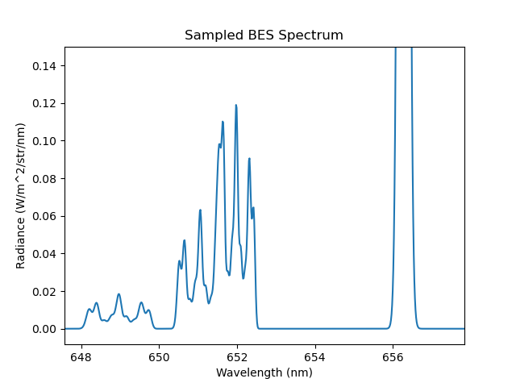

.. _beam_bes:

Beam Emission Spectroscopy
==========================

This demonstration shows how to model the Beam Emission Spectrum (BES) from a beam-plasma
interaction. These features are sometimes also known as the Motional Stark Effect (MSE)
features. A slab plasma is setup as the target, with a neutral beam injected along the x
axis. It is possible to change the sigma to pi ratios by overriding the line ratio functions
as arguments to the BeamEmissionLine() model.

.. literalinclude:: ../../../../demos/emission_models/beam_emission_spectrum.py

   **Caption:** A camera view of a beam entering a slab plasma. The camera is tuned to
   D-alpha light. We can see the background passive emission of the neutrals hitting
   the slab as well as the beam emission light.

   **Caption:** A x-z slice of the beam density profile showing the optical sightline.
   The amount of Motional Stark Effect (MSE) splitting is direction dependent.

.. figure:: BES_spectrum_full.png
   :align: center
   :width: 450px

   **Caption:** The full beam emission spectrum showing the passive emision peak as
   well as the three beam emission multiplet components.

   **Caption:** A zoomed in view of the BES feature.

