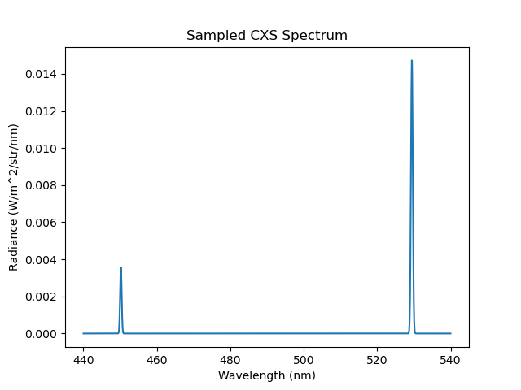

.. _beam_cxs:

Charge Exchange Spectroscopy
============================

This demonstration shows how to model the Charge Exchange Spectroscopy (CXS)
spectrum from a beam-plasma interaction. A slab plasma is setup as the target, with a neutral
beam injected along the x axis. The BeamCXLine() emission model is added as a property of
the beam object.

.. literalinclude:: ../../../../demos/emission_models/charge_exchange.py

   **Caption:** A camera view of a beam entering a slab plasma. The colouring of the image is
   due to the mixing of both charge exchange spectral lines.

   **Caption:** The observed spectrum reveals observations of both active charge exchange lines.

.. figure:: CXS_multi_sightlines.png
   :align: center
   :width: 450px

   **Caption:** A zoomed in spectral view of the commonly studied CVI n = 8->7 CXS line.
   The lines are doppler shifted due to the velocity of the plasma.

