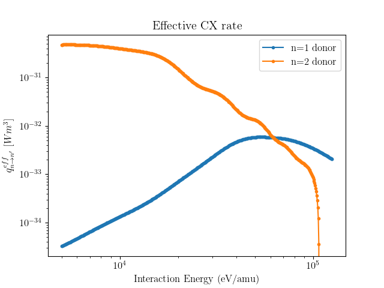

.. _beam_plasma_interaction_rates:

Beam-Plasma Interaction Rates
=============================

Some example code for requesting beam rate objects and sampling them with the __call__()
method.

.. literalinclude:: ../../../../demos/openadas/beam_plasma_interaction_rates.py

.. figure:: beam_emission_rates.png
   :align: center
   :width: 450px

