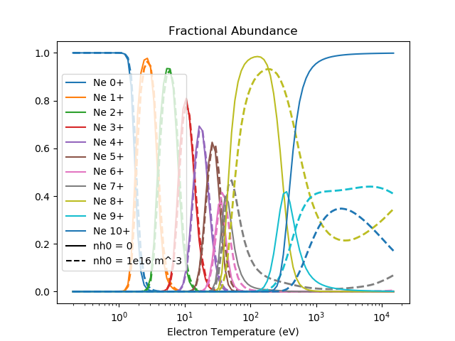

.. _fractional_abundances:

Fractional Abundances
=====================

Some example code for requesting fractional abundances and plotting them.

.. code-block:: pycon

   >>> import matplotlib.pyplot as plt
   >>> plt.ion()
   >>>
   >>> from cherab.core.atomic import neon
   >>> from cherab.adas import ADAS
   >>>
   >>> atomic_data = ADAS()
   >>>
   >>> plt.figure()
   >>> ne0_frac = atomic_data.fractional_abundance(neon, 0)
   >>> ne0_frac.plot_temperature()
   >>> ne1_frac = atomic_data.fractional_abundance(neon, 1)
   >>> ne1_frac.plot_temperature()
   >>> ne2_frac = atomic_data.fractional_abundance(neon, 2)
   >>> ne2_frac.plot_temperature()
   >>> ne3_frac = atomic_data.fractional_abundance(neon, 3)
   >>> ne3_frac.plot_temperature()
   >>> ne4_frac = atomic_data.fractional_abundance(neon, 4)
   >>> ne4_frac.plot_temperature()
   >>> ne5_frac = atomic_data.fractional_abundance(neon, 5)
   >>> ne5_frac.plot_temperature()
   >>> ne6_frac = atomic_data.fractional_abundance(neon, 6)
   >>> ne6_frac.plot_temperature()
   >>> ne7_frac = atomic_data.fractional_abundance(neon, 7)
   >>> ne7_frac.plot_temperature()
   >>> ne8_frac = atomic_data.fractional_abundance(neon, 8)
   >>> ne8_frac.plot_temperature()
   >>> ne9_frac = atomic_data.fractional_abundance(neon, 9)
   >>> ne9_frac.plot_temperature()
   >>> ne10_frac = atomic_data.fractional_abundance(neon, 10)
   >>> ne10_frac.plot_temperature()
   >>>
   >>> plt.legend()
   >>> plt.title("Fractional abundance of Neon in coronal equilibrium")
   >>> plt.xlabel("Electron Temperature (eV)")
   >>> plt.ylabel("Fractional Abundance (%)")

