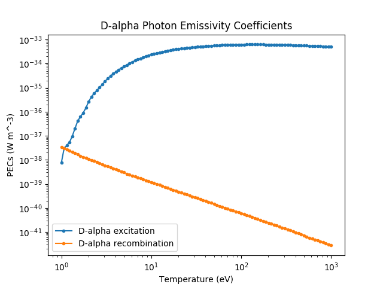

.. _photon_emissivity_coefficients:

Photon Emissivity Coefficients
==============================

Some example code for requesting PEC objects and sampling them with the __call__()
method.

.. code-block:: pycon

   >>> import numpy as np
   >>> import matplotlib.pyplot as plt
   >>> from cherab.core.atomic import deuterium
   >>> from cherab.openadas import OpenADAS
   >>>
   >>> # initialise the atomic data provider
   >>> adas = OpenADAS()
   >>>
   >>> # request d-alpha instance of ImpactExcitationRate
   >>> dalpha_excit = adas.impact_excitation_pec(deuterium, 0, (3, 2))
   >>> # request d-alpha instance of RecombinationRate
   >>> dalpha_recom = adas.recombination_pec(deuterium, 0, (3, 2))
   >>>
   >>> # settings for plot range
   >>> temp_low = 1
   >>> temp_high = 1000
   >>> num_points = 100
   >>> electron_density = 1E19
   >>> electron_temperatures = [10**x for x in np.linspace(np.log10(temp_low), np.log10(temp_high), num=num_points)]
   >>>
   >>> # sample the PECs with __call__()
   >>> dalpha_excit_pecs = [dalpha_excit(electron_density, te) for te in electron_temperatures]
   >>> dalpha_recom_pecs = [dalpha_recom(electron_density, te) for te in electron_temperatures]
   >>>
   >>> # plot the PEC rates
   >>> plt.figure()
   >>> plt.loglog(electron_temperatures, dalpha_excit_pecs, '.-', label="D-alpha excitation")
   >>> plt.loglog(electron_temperatures, dalpha_recom_pecs, '.-', label="D-alpha recombination")
   >>> plt.xlabel("Temperature [eV]")
   >>> plt.ylabel("PECs [W m^3]")
   >>> plt.legend()
   >>> plt.show()

   **Caption:** A plot of balmer D-alpha PEC coefficients generated by the above code snippet.
