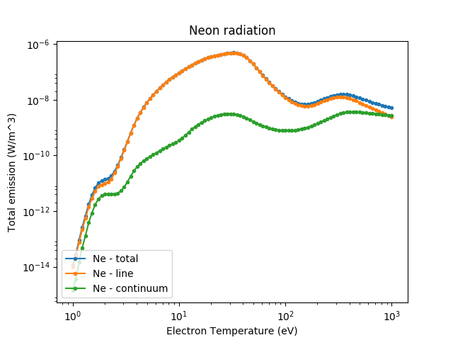
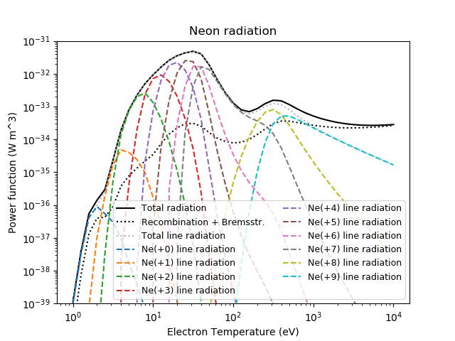

.. _radiated_powers:

Radiated Powers
===============

Sampling and plotting total and stage resolved radiated powers with the ADAS
subscription package.

.. code-block:: pycon

   >>> import matplotlib.pyplot as plt
   >>> plt.ion()
   >>>
   >>> from cherab.core.atomic import neon
   >>> from cherab.adas import ADAS
   >>>
   >>> atomic_data = ADAS()
   >>>
   >>> plt.figure()
   >>>
   >>> ne_total_rad = atomic_data.radiated_power_rate(neon, 'total')
   >>> ne_total_rad.plot_temperature()
   >>>
   >>> ne_line_rad = atomic_data.radiated_power_rate(neon, 'line')
   >>> ne_line_rad.plot_temperature()
   >>>
   >>> ne_continuum_rad = atomic_data.radiated_power_rate(neon, 'continuum')
   >>> ne_continuum_rad.plot_temperature()
   >>>
   >>> plt.xlabel("Electron Temperature (eV)")
   >>> plt.ylabel("Total emission (W/m^3)")
   >>> plt.title("Neon radiation")
   >>> plt.legend(loc=3)
   >>>
   >>>
   >>> plt.figure()
   >>>
   >>> ne0_line_rad = atomic_data.stage_resolved_line_radiation_rate(neon, 0)
   >>> ne0_line_rad.plot_temperature()
   >>> ne1_line_rad = atomic_data.stage_resolved_line_radiation_rate(neon, 1)
   >>> ne1_line_rad.plot_temperature()
   >>> ne2_line_rad = atomic_data.stage_resolved_line_radiation_rate(neon, 2)
   >>> ne2_line_rad.plot_temperature()
   >>> ne3_line_rad = atomic_data.stage_resolved_line_radiation_rate(neon, 3)
   >>> ne3_line_rad.plot_temperature()
   >>> ne4_line_rad = atomic_data.stage_resolved_line_radiation_rate(neon, 4)
   >>> ne4_line_rad.plot_temperature()
   >>> ne5_line_rad = atomic_data.stage_resolved_line_radiation_rate(neon, 5)
   >>> ne5_line_rad.plot_temperature()
   >>> ne6_line_rad = atomic_data.stage_resolved_line_radiation_rate(neon, 6)
   >>> ne6_line_rad.plot_temperature()
   >>> ne7_line_rad = atomic_data.stage_resolved_line_radiation_rate(neon, 7)
   >>> ne7_line_rad.plot_temperature()
   >>> ne8_line_rad = atomic_data.stage_resolved_line_radiation_rate(neon, 8)
   >>> ne8_line_rad.plot_temperature()
   >>> ne9_line_rad = atomic_data.stage_resolved_line_radiation_rate(neon, 9)
   >>> ne9_line_rad.plot_temperature()
   >>> ne10_line_rad = atomic_data.stage_resolved_line_radiation_rate(neon, 10)
   >>> ne10_line_rad.plot_temperature()
   >>>
   >>> plt.xlabel("Electron Temperature (eV)")
   >>> plt.ylabel("Total Line Emission (W/m^3)")
   >>> plt.title("Neon - Stage Resolved Line Radiation")
   >>> plt.legend(loc=3)

