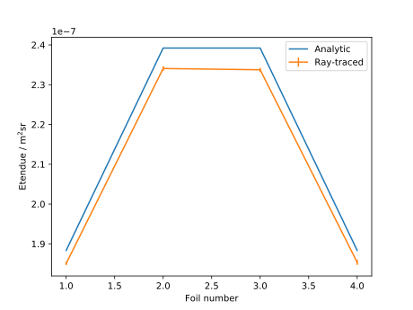

.. _bolometer_etendue:

Calculating the Etendue of Bolometer Foils
==========================================

In this demonstration we calculate the etendue of each of the bolometer foils in a
camera. The camera is produced in the same way as in the :ref:`Camera From Primitives
<bolometer_from_primitives>` demo.

A simple analytic formula for the etendue of a foil-aperture system is:

.. math:: G = \frac{A_{foil} A_{slit} \cos{\theta_{foil}} \cos{\theta_{slit}}}{d^2}

This formula is a good approximation when the distance :math:`d` between the foil and
slit is large compared with the foil area :math:`A_{foil}` and the slit area
:math:`A_{slit}` (i.e. when the system is well approximated by an infinitesimal
pinhole and detector), but as the foil and slit become finite in size it becomes less
accurate and a full 3D treatment is required instead.

The :class:`BolometerFoil` object has a `calculate_etendue` method which makes
this very simple. All that is required is to load the bolometer geometry information
and camera body into an otherwise-empty scenegraph and call the `calculate_etendue`
method on the foil.

.. literalinclude:: ../../../../demos/observers/bolometry/calculate_etendue.py

The program outputs the following text, along with a plot of the etendues. Note that the
actual values may be slightly different, due to the Monte-Carlo sampling technique used.

.. code-block:: console

   Foil 1 raytraced etendue: 1.851e-07 +- 4e-10 analytic: 1.883e-07
   Foil 2 raytraced etendue: 2.341e-07 +- 6e-10 analytic: 2.392e-07
   Foil 3 raytraced etendue: 2.338e-07 +- 5e-10 analytic: 2.392e-07
   Foil 4 raytraced etendue: 1.854e-07 +- 6e-10 analytic: 1.883e-07

   **Caption** The etendue of the foils, calculated analytically and also by ray
   tracing. There is good agreement between the two methods, with the ray tracing method
   producing a slightly lower etendue value. The analytic method has been shown to
   overestimate the etendue when the foil-slit distance is small compared with the
   aperture size (see the `example
   <https://raysect.github.io/documentation/demonstrations/optics/etendue_of_pinhole.html#demo-etendue-of-pinhole>`_
   in the raysect documentation), which is consistent with this result.
