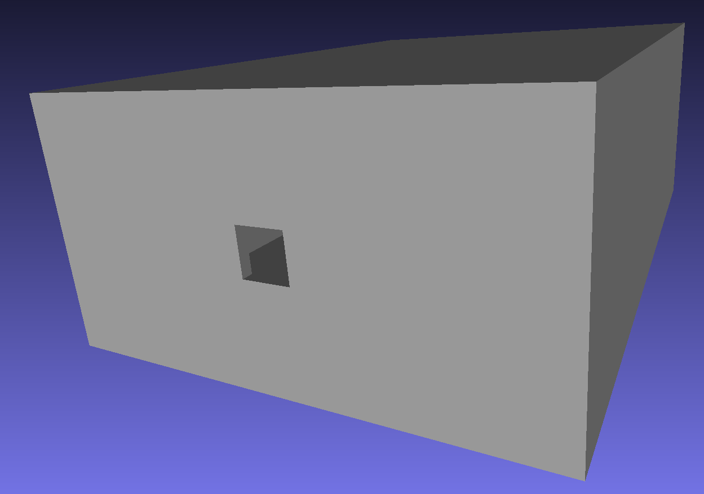
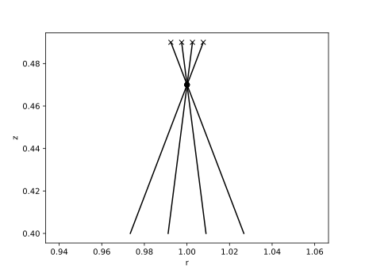

.. _bolometer_from_mesh:

Building a Bolometer Camera Using a Mesh and Corner Coordinates
===============================================================

In this demonstration we build a simple bolometer camera from coordinates of the corners
of an aperture and 4 foils which are defined in the world's coordinate system. These
define the position and the orientation of the bolometer system. The wall geometry of
the camera is provided by an STL mesh file. This information may have been retrived by
extracting an STL file or STP file from a CAD model of the machine. The coordinates of
the slit and foils could have been read from this model directly using an STL viewing
program.

   **Caption** A render of the camera mesh by the meshlab program, showing the
   rectangular box and aperture. The bolometer foils will be inside the box, but don't
   need their own mesh model.

A camera geometry should **always** be present, else there is the risk that
stray light can reach the modelled bolometer foils when it would be blocked by the
camera enclosure in a physical system. Using a realistic camera geometry with a suitable
material (e.g. metal or carbon) will also permit modelling of reflections inside the
camera. In this example we ignore reflections, by making the camera body perfectly
absorbing.

Once the camera is designed, we plot the lines of sight of the system. These are
calculated by tracing a ray from the centre of the foil through the centre of the slit,
and then determining the intersection point on a distant surface. This is a quick and
easy way to check the viewing geometry of the detector, but does not show the full 3D
field of view of each foil. For that examine the sensitivity matrix demos.

.. literalinclude:: ../../../../demos/observers/bolometry/camera_from_mesh_and_coordinates.py

   **Caption** The positions of the foils ("x"), the slit (".") and the lines of sight
   for a simple bolometer camera, plotted in the R-Z plane.
