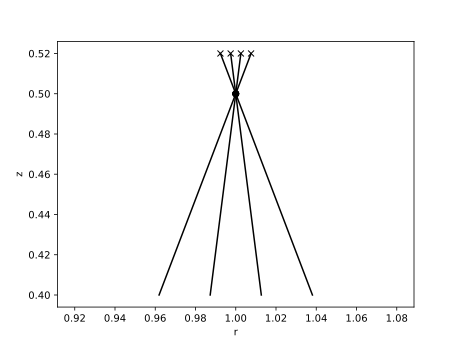

.. _bolometer_from_primitives:

Building a Bolometer Camera Using Geometric Primitives
======================================================

In this demonstration we build a simple bolometer camera using geometric primitives from
raysect. The camera itself is a rectangular box, with a rectangular aperture forming the
slit. There are 4 bolometer foils inside the box. The slit and foil positions and
orientations are defined relative to the camera. Defining a bolometer system in this way
is common when working from design drawings.

We use raysect primitives (:class:`Box` and CSG operations) to describe the geometry of
the system. A camera geometry should **always** be present, else there is the risk that
stray light can reach the modelled bolometer foils when it would be blocked by the
camera enclosure in a physical system. Using a realistic camera geometry with a suitable
material (e.g. metal or carbon) will also permit modelling of reflections inside the
camera. In this example we ignore reflections, by making the camera body perfectly
absorbing.

Once the camera is designed, we plot the lines of sight of the system. These are
calculated by tracing a ray from the centre of the foil through the centre of the slit,
and then determining the intersection point on a distant surface. This is a quick and
easy way to check the viewing geometry of the detector, but does not show the full 3D
field of view of each foil. For that examine the sensitivity matrix demos.

.. literalinclude:: ../../../../demos/observers/bolometry/camera_from_primitives.py

   **Caption** The positions of the foils ("x"), the slit (".") and the lines of sight
   for a simple bolometer camera, plotted in the R-Z plane.
