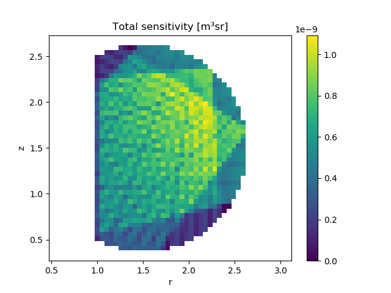

.. _bolometer_geometry_voxels:

Calculating a Geometry Matrix using the Voxel Framework
=======================================================

In this demonstration, we calculate the geometry matrix for a slightly more complicated
bolometer system, consisting of 3 cameras each of which have 16 foils looking through a
single aperture. For simplicity we discretise the measurement space into toroidally
symmetric voxels of identical rectangular cross section, although it is possible to
have an arbitrary cross section in the voxel framework.

In addition to the geometry matrix, a regularisation operator is generated. This is
needed for regularised tomographic inversions, as shown in the :ref:`Inversion with
Voxels <bolometer_voxel_inversion>` demo. We use a simple Laplacian operator as the
regularisation operator, which corresponds to isotropic smoothing.

.. literalinclude:: ../../../../demos/observers/bolometry/geometry_matrix_with_voxels.py

.. figure:: bolometer_inversion_lines_of_sight.svg
   :align: center

   **Caption** The lines of sight of the 48 foils in 3 bolometer cameras, used to
   generate the sensitivity matrix.

   **Caption** The result of summing the sensitivty of all foils, for each voxel in the
   voxel collection.
