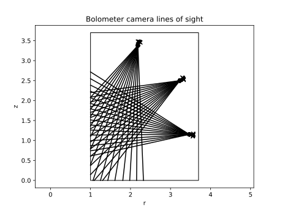
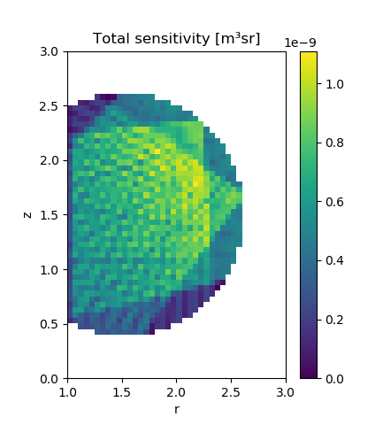

.. _bolometer_geometry_raytransfer:

Calculating a Geometry Matrix using Ray Transfer Objects
========================================================

In this demonstration, we calculate the geometry matrix for a slightly more complicated
bolometer system, consisting of 3 cameras each of which have 16 foils looking through a
single aperture. This produces the same end result as the :ref:`Geometry Matrix With
Voxels <bolometer_geometry_voxels>` demo, but with significantly higher performance when
calculating the sensitivity matrix itself. Since the voxel demo uses axisymmetric voxels
with a rectangular cross section the results of the two frameworks are directly
comparable. Voxels with arbitrary gometry cannot be represented exactly with the ray
transfer framework, but can be approximated by combining multiple cubiod or axisymmetic
(with rectangular cross section) cells into single larger voxels. With a large enough
number of cells the approximation will be quite good.

In addition to the geometry matrix, a regularisation operator is generated. This is
needed for regularised tomographic inversions, as shown in the :ref:`Inversion with
Ray Transfer Objects <bolometer_raytransfer_inversion>` demo. We use a simple Laplacian operator as the
regularisation operator, which corresponds to isotropic smoothing.

.. literalinclude:: ../../../../demos/observers/bolometry/geometry_matrix_with_raytransfer.py

   **Caption** The lines of sight of the 48 foils in 3 bolometer cameras, used to
   generate the sensitivity matrix.

   **Caption** The result of summing the sensitivty of all foils, for each voxel in the
   ray transfer object. Since we are using a mask, only a subset of the ray transfer
   object's cells are treated as voxels to be calculated: in the rest the sensitivity is
   undefined.
