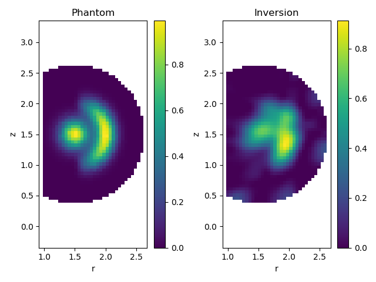
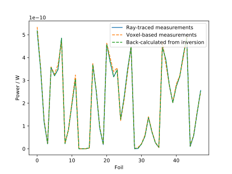

.. _bolometer_voxel_inversion:

Performing Inversions of Bolometer Measurements Using the Voxel Framework
=========================================================================

In this demonstration, we take the geometry matrix and regularisation operator
calculated in the :ref:`Geometry Matrix Calculation Using Voxels
<bolometer_geometry_voxels>` demonstration and use them to perform an inversion of
simulated bolometer measurements from a defined emissivity profile. The emission source
is the same one used in the :ref:`Defining A Radiation Function <radiation_function>`
demo.

The bolometer system geometry is necessarily the same as that used to calculate the
geometry matrix. To perform the inversion we use the regularised NNLS routine, with the
voxel grid's Laplacian operator as the regularisation matrix. The `alpha` parameter
which controls the regularisation was chosen simply by trying different values until the
result looked reasonable. Of course, once the measurement vector, geometry matrix and
regularisation operator have been calculated then any matrix inversion algorithm can be
used to calculate the emissivity profile: we are showcasing one of Cherab's built-in
routines here for convenience.

We have deliberately calculated the measurement vector here by calling the `observe`
method of :class:`BolometerCamera`, as this produces measurements independent of the
voxel grid. If many emission profiles are being inverted for the same bolometer and
voxel grid geometries, it would be substantially faster to sample the emission
function on the voxel grid and then multiply this by the sensitivity matrix (this is
done in this demo script to produce the plot of the phantom).

.. literalinclude:: ../../../../demos/observers/bolometry/inversion_with_voxels.py

The demo prints the total power calculated from the phantom emissivity profile and the
inverted profile. There is good agreement between the two, with only a 4% discrepancy.

.. code-block:: console

   Measuring the radiation with the bolometers...
   Performing inversion...
   Plotting results...
   Phantom total power: 4.838W
   Inversion total power: 5.03W

   **Caption** The input and reconstructed emissivity profiles. The general profile
   shape is preserved, with the central blob and ring radiator visible in the
   inversion. There are a few artefacts around the edge of the reconstruction volume,
   particularly near the bottom. Note also that there is more blurring of the boundary
   between the central and ring radiators in the upper half of the image: this reflects
   the fact that the bolometer sightlines are not symmetric above and below the
   midplane.

   **Caption** The forward-modelled and back-calculated power measurements on the foils.
   The measured power using ray tracing in this script, the calculated power by
   multiplying the sensitivity matrix by the emission vector and the back-calculated
   power calculated by multiplying the sensitivity matrix by the inverted emissivity are
   all in good agreement, showing that the voxel size and the amount of regularisation
   are suitable in this case.
