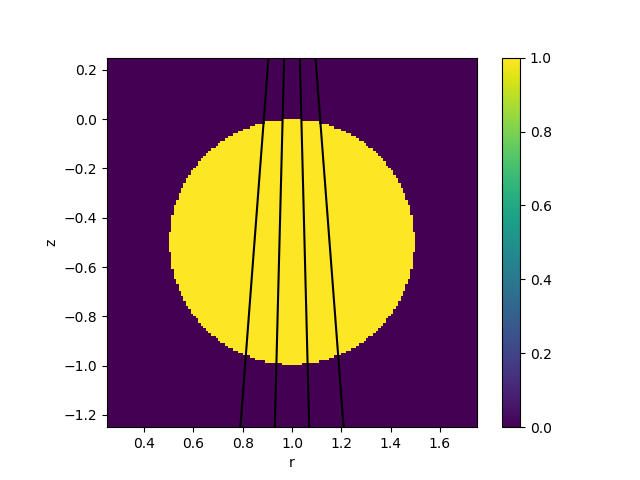

.. _bolometer_observing_radiation:

Observing a 3D Radiation Function with a Bolometer
==================================================

In this demonstration we forward model the measured power on a synthetic bolometer
diagnostic viewing a 3D --- but axisymmetric --- emissivity profile. The emissivity
profile is defined in the R-Z plane and then mapped to 3D world space. The bolometer
system is produced in the same way as in the :ref:`Camera From Primitives
<bolometer_from_primitives>` demo. The emitter is produced in the same way as in the
:ref:`Defining A Radiation Function <radiation_function>` demo, except that the emission
profile is a torus with circular cross section and uniform emissivity of 1W/m³.

   **Caption** A slice through the 3D emission function in the R-Z plane, along with the
   lines of sight of the bolometer foils.

5 measurements are presented:

    - Power measured on the foil
    - Radiance measured by a single line of sight observer
    - Radiance measured on the foil, using the volumetric power divided by the etendue
    - Radiance measured on the foil, using the radiance pipeline
    - Brightness measured on the foil, assuming the power is radiated isotropically

Note that the radiance pipeline measures the radiance averaged over the entire solid
angle of the detector, which is :math:`2\pi` steradians for a bolometer foil. To get a
meaningful comparison with the sightline observer we need to renormalise to the
fractional solid angle subtended by the foil-slit system. This is described in more
detail in the :ref:`Bolometry <observers_bolometers>` section of the documentation.

.. literalinclude:: ../../../../demos/observers/bolometry/observe_radiation_function.py

The demo prints the following output (note that subsequent runs may have slightly
different numbers due to random sampling of the emitting material):

.. code-block:: console

    Measured power for Foil 1:		7.55e-10 +- 2e-12 W
    Sightline radiance for Foil 1:	0.0813 W/m2/sr
    Radiance from power for Foil 1:	0.081 +- 0.0007 W/m2/sr
    Measured radiance for Foil 1:	0.0721 +- 0.0006 W/m2/sr
    Calculated brightness for Foil 1:	0.906 +- 0.008 W/m2

    Measured power for Foil 2:		6.93e-10 +- 2e-12 W
    Sightline radiance for Foil 2:	0.0716 W/m2/sr
    Radiance from power for Foil 2:	0.0735 +- 0.0004 W/m2/sr
    Measured radiance for Foil 2:	0.0735 +- 0.0004 W/m2/sr
    Calculated brightness for Foil 2:	0.923 +- 0.005 W/m2

    Measured power for Foil 3:		6.93e-10 +- 2e-12 W
    Sightline radiance for Foil 3:	0.0716 W/m2/sr
    Radiance from power for Foil 3:	0.0735 +- 0.0005 W/m2/sr
    Measured radiance for Foil 3:	0.0736 +- 0.0005 W/m2/sr
    Calculated brightness for Foil 3:	0.925 +- 0.007 W/m2

    Measured power for Foil 4:		6.71e-10 +- 2e-12 W
    Sightline radiance for Foil 4:	0.0718 W/m2/sr
    Radiance from power for Foil 4:	0.0717 +- 0.0006 W/m2/sr
    Measured radiance for Foil 4:	0.072 +- 0.0006 W/m2/sr
    Calculated brightness for Foil 4:	0.905 +- 0.007 W/m2

The brightness (i.e. the integral of the emissivity along the field of view of each
bolometer assuming the emission is radiated isotropically into :math:`4\pi` steradians)
is approximately 1W/m². The emissivity profile is a constant 1W/m³ and the emitter has a
diameter of 1m, so these numbers are reasonable.
