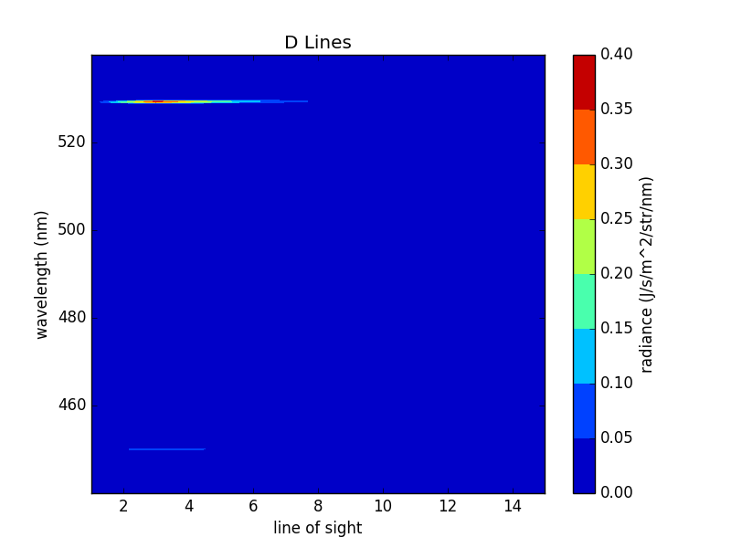

.. _jet_cxrs_quickstart:

Quickstart Example
==================

Preamble
--------

This is a commented demo file about how to use Cherab. It aims to give an
example with the main steps for a basic use of Cherab. We start by importing
the classes used in this demo.::

    # External imports
    import matplotlib.pyplot as plt
    import numpy as np
    from scipy.constants import electron_mass, atomic_mass
    from raysect.core import Vector3D
    from raysect.core.scenegraph.utility import print_scenegraph

    # Internal imports
    from cherab import Species
    from cherab.atomic import elements, Line
    from cherab.atomic.adas import ADAS
    from cherab.distribution import Maxwellian
    from cherab.math.mapping.interpolators.interpolators1d import Interpolate1DCubic
    from cherab.math.mapping.mappers import IsoMapper3D
    from cherab.model.cxs.beaminteraction import CXSBeamPlasmaIntersection
    from cherab.model.beam.singleray import SingleRayAttenuator
    from cherab_contrib.jet.corentin.ppf_access import *
    from cherab_contrib.jet.corentin.data_source import DataSource
    from cherab_contrib.jet.corentin.neutralbeam import PINIParameters
    from cherab_contrib.jet.corentin.scenegraph import build_jet_scenegraph

In this demo we will simulate the carbon active CX spectra emitted by octant
8 PINIs and seen from different lines of sight. We use input data from
pulse 79503 at t=61s.::

    PULSE = 79503
    TIME = 61.

To achieve this simulation we need to set up the scenegraph, which means placing
beams and lines of sight in a first place, and providing parameters and plasma
profiles in a second place.

Scenegraph Creation
-------------------

The first step is to generate the scenegraph and to give the geometry and physical
models needed. The scenegraph is created through the `build_scenegraph` function.
This function build PINIs and lines of sight with the geometry given in geometry
files, which are in cherab.machine.jet.geometries. Given a pulse number, `build_scenegraph`
will look through this module to find the files valid for this pulse and create
the scenegraph components whose geometry is defined in these files. For pulse 79503,
`build_scenegraph` will create NIB8 PINIs and ks5 and ks7 lines of sight.

`build_scenegraph` also need an atomic data provider and the physical models you
want to use:

`ADAS` is the atomic data provider to be used for JET. It is the result of a
home-made submodule (cherab.atomic.adas): ::

    atomic_data = ADAS(permit_extrapolation=True)

Physical models:
for the beam attenuation model we use `SingleRayAttenuator` (cherab.model.beam.singleray)
and for CX active emissions we use `CXSBeamPlasmaIntersection` (cherab.model.cxs.beaminteraction)
These models must not be called here, as they will be separately for each beam.
Instead they must be given as a tuple with the class object in the first place
and a dictionary containing arguments in the second place: ::

    attenuation_instruction = (SingleRayAttenuator, {'step': 0.01, 'clamp_to_zero': True})

We want to observe the C5+ lines n=8->7 and n=10->8, so let's define these lines: ::

    line_1 = Line(elements.carbon, 5, (8, 7))
    line_2 = Line(elements.carbon, 5, (10, 8))

The CX active emission model uses this line as a parameter.
As it is possible to use different emission models (eg for different lines),
they must be given in a list of tuples as defined above: ::

    emission_instructions = [(CXSBeamPlasmaIntersection, {'line': line_1,  'step': 0.03}),
                             (CXSBeamPlasmaIntersection, {'line': line_2,  'step': 0.03})]

Now we can call `build_scenegraph`. It returns a World object which is the root
of the scenegraph created, a Plasma object which will contain and provide all
plasma profiles, and a dictionary named components which contains the main components
of the scenegraph with which you will be able to adjust parameters. Here we extract
NIB8 (containing the PINIs) and two groups of lines of sight. ::

    world, plasma, components = build_jet_scenegraph(PULSE, atomic_data,
                                                     attenuation_instruction,
                                                     emission_instructions)

    nib8 = components['nib8']
    ks5_oct1 = components['ks5_oct1']
    ks7_oct8 = components['ks7_oct8']

We can adjust observation parameters for a whole group of lines of sight: ::

    ks5_oct1.min_wavelength = 440
    ks5_oct1.max_wavelength = 540
    ks5_oct1.spectral_samples = 1000

Plasma Configuration
--------------------

To set up a real plasma, we need to feed `plasma` with profiles and composition.

Now we are looking for information about the plasma (temperature, density, etc)
in the PPF system. Here they are generally given as profile arrays along
normalised psi values. As Cherab need any plasma input given as a 3D function
the first step is to get normalised psi as a 3D function through the `DataSource`
object: ::

    src = DataSource()
    src.time = TIME
    src.n_pulse = PULSE
    psi = src.get_psi_normalised(exterior_value=1, cached2d=True)
    inside = lambda x, y, z: psi(x, y, z) != 1.

`psi` is the 3D function giving normalised psi (taken from EFIT) inside the LCFS,
and an exterior value which can be changed, outside. This outside value can be
used to define a `inside` function returning a boolean, which will be useful
to define the plasma later.

To get data from PPF system one can use the python ppf library or a wrapped
version of it (cherab.machine.jet.ppf_access) which uses python exceptions
instead of error integers (so the content is exactly the same):  ::

    ppfsetdevice("JET")
    ppfuid('cgiroud', rw='R')
    ppfgo(pulse=PULSE, seq=0)

Here a personal DDA is used. We use ppfget to read Data Types as they don't have a
time axis. However one should use ppfgts to read Data Types at a specific time (`TIME`)
if it contains a time axis as Cherab require data at a specific time only: ::

    # normalised psi coordinates
    psi_coord = np.array(ppfget(PULSE, 'PRFL', 'C6')[3], dtype=np.float64)
    mask = psi_coord <= 1.0  # a mask is created to get only the values inside the LCFS
    psi_coord = psi_coord[mask]

    flow_velocity_tor_data = np.array(ppfget(PULSE, 'PRFL', 'VT')[2], dtype=np.float64)[mask]
    ion_temperature_data = np.array(ppfget(PULSE, 'PRFL', 'TI')[2], dtype=np.float64)[mask]
    electron_density_data = np.array(ppfget(PULSE, 'PRFL', 'NE')[2], dtype=np.float64)[mask]
    density_c6_data = np.array(ppfget(PULSE, 'PRFL', 'C6')[2], dtype=np.float64)[mask]

    # Now these arrays are interpolated to get 1D functions of normalised psi:
    flow_velocity_tor_psi = Interpolate1DCubic(psi_coord, flow_velocity_tor_data, extrapolate=True)
    ion_temperature_psi = Interpolate1DCubic(psi_coord, ion_temperature_data, extrapolate=True)
    electron_density_psi = Interpolate1DCubic(psi_coord, electron_density_data, extrapolate=True)
    density_c6_psi = Interpolate1DCubic(psi_coord, density_c6_data, extrapolate=True)
    # Extrapolation is allowed by turning to True the `extrapolate` argument.

1D functions are composed with the 3D function `psi` to get 3D functions giving
velocity, temperature, etc. We use `IsoMapper3D` from a home-made submodule
(cherab.math.mapping.mappers) as it is written in cython and then is faster
than using `lambda` functions: ::

    flow_velocity_tor = IsoMapper3D(psi, flow_velocity_tor_psi)
    ion_temperature = IsoMapper3D(psi, ion_temperature_psi)
    electron_density = IsoMapper3D(psi, electron_density_psi)
    density_c6 = IsoMapper3D(psi, density_c6_psi)

So as to be able to handle any velocity profile, The flow velocity must be
described as a vector field. Here we just use a toroidal velocity. ::

    flow_velocity = lambda x, y, z: Vector3D(y * flow_velocity_tor(x, y, z),
                                             - x * flow_velocity_tor(x, y, z),
                                             0.) / np.sqrt(x*x + y*y)

In this simulation the plasma is composed of only deuterium and carbon. To get
the deuterium density we just have to deduce it from carbon and electron densities: ::

    density_d = electron_density - 6 * density_c6

Note that `electron_density` and `density_c6` can be added and multiplied so
easily (they are functions and not values!) because they are returned by
`IsoMapper3D`. Like any function returned by mappers or interpolators submodules
they are also written in cython allowing fast evaluation.

Any species (main ion, impurities and electrons) distribution in space and velocity
space is described in a `Distribution` object. Any distribution can be used,
but here we only need maxwellian distributions. A `Maxwellian` function is used
to give this distribution directly out of density, temperature, velocity and particle mass (in kg): ::

    d_distribution = Maxwellian(density_d, ion_temperature, flow_velocity,
                                elements.deuterium.atomic_weight * atomic_mass)
    c6_distribution = Maxwellian(density_c6, ion_temperature, flow_velocity,
                                 elements.carbon.atomic_weight * atomic_mass)
    e_distribution = Maxwellian(electron_density, ion_temperature, flow_velocity, electron_mass)

Notes:

1. Here we use the same temperature and velocity for all species, but it is not
   a requirement at all.
2. In Cherab, information about species are often given through an `Element`
   object from the elements submodule (cherab.atomic.elements). eg the mass of
   deuterium (in amu) is given by `elements.deuterium.atomic_weight`.
3. From here units become important. In Cherab, any density must be given in
   m^-3, any temperature in eV and any velocity in m/s. These units must be
   used to create the species distributions.

Now the distributions have been defined, we must associate them to a species.
Species are created from an element, a ionisation and a distribution. Electron
distribution will be used directly by Cherab so we don't need to create a species
for electrons: ::

    d_species = Species(elements.deuterium, 1, d_distribution)
    c6_species = Species(elements.carbon, 6, c6_distribution)

We fill the plasma with the species and the electron distribution
we just built, and the `inside` function for the plasma to know its boundaries. ::

    plasma.inside = inside
    plasma.electron_distribution = e_distribution
    plasma.set_species([d_species, c6_species])

A plasma is also describe with a magnetic field which must be given (as a 3D
vector field, in Tesla). Even if it is not actually used, it is necessary to
get ADAS CX rates. Here a toroidal unitary vector field is given: ::

    plasma.b_field = lambda x, y, z: Vector3D(y, -x, 0.).normalise()

PINI Configuration
------------------

The plasma have been entirely set up, let's set the PINIs parameters. PINIs will be composed of deuterium: ::

    beam_element = elements.deuterium

PINIs parameters are regrouped under an instance of `PINIParameters`. For JET
octant 8 PINIs, we need information about 8 PINIS, so: ::

    # an array of 8 energies (from PINI1 to PINI8) in eV/amu:
    energy = np.array([99707.2, 99707.2, 102295., 102295.,
                       96386.5, 1., 101416., 101855.], dtype=np.float64)  # in eV
    energy = energy / beam_element.atomic_weight  # in eV/amu

    # an array of 3*8 power fractions in W:
    powers = np.array([[947863., 1053350., 888242., 1091590., 936611., 0., 1066350., 1066350.],  # main component
                       [550345., 202872., 526211., 213485., 176385., 0., 208979., 208035.],  # half component
                       [324286., 193540., 283783., 190731., 182980., 0., 190921., 187949.]],  # third component
                      dtype=np.float64)

    # an array of 8 booleans to give the status (turned on/turned off) of the PINIs:
    turned_on = np.array([True, True, True, True, False, False, True, False], dtype=bool)

    # Note PINI6 has 0 power and an unusual energy, but these values will not be
    # used as PINI6 is turned off.

    # Regroupment of data, including the beam species:
    pini_parameters = PINIParameters(energy, powers, turned_on, beam_element)

    # We can feed NIB8 with these PINI parameters:
    nib8.pini_parameters = pini_parameters

Observation
-----------

The scenegraph have been completely set up now! To be sure, we can have a look
at it with `print_scenegraph` from raysect.core.scenegraph.utility: ::

    print_scenegraph(world)

To make observations, we must choose a line of sight or a group of lines of sight
and call the `observe` method. The `display` method allow to plot the result.

From a line of sight group, each line of sight can be accessed by calling `get_los`
with the name of the line of sight. Names are defined in the geometry files. ::

    los_o8l10 = ks7_oct8.get_los('O8L_10')

ks5_oct1 is a particular case as it is a group of groups. Each of its group has
a name which is defined in its geometry file too (they represents C, D, B from
1 to 3 and B from 4 to 6 lines of sight). You can access a particular group with
`get_los_group` method: ::

    los_d5 = ks5_oct1.get_los_group('D Lines').get_los('D5')
    # Or get directly a particular line of sight:
    los_d5_direct = ks5_oct1.get_los('D5')
    print(los_d5 is los_d5_direct)

For instance let's make all the D lines from ks5_oct1 observe and display the result: ::

    ks5_oct1.get_los_group('D Lines').observe()
    ks5_oct1.get_los_group('D Lines').display()

If you want to have a look at a particular spectrum, eg the one of D5: ::

    los_d5.display()

    # the display is by default in J/s/m^3/str/nm, it can be turned in photons/s/m^3/str/nm:
    los_d5.display(unit='ph')

After observing, any line of sight store the measured spectrum in a `spectrum` attribute: ::

    d5_spectrum = los_d5.spectrum
    plt.plot(d5_spectrum.wavelengths, d5_spectrum.samples)
    plt.show()

As for the display, the spectrum is in J/s/m^3/str/nm, you can generate an array
of data in photons/s/m^3/str/nm using `to_photons` method: ::

    photons_samples = d5_spectrum.to_photons()
    plt.plot(d5_spectrum.wavelengths, photons_samples)
    plt.show()

