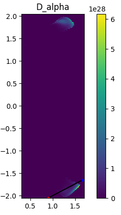
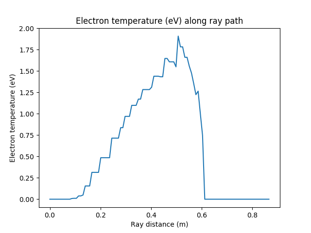
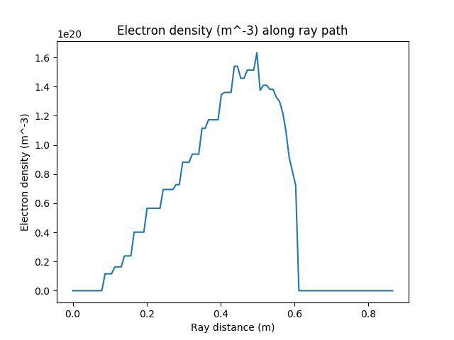
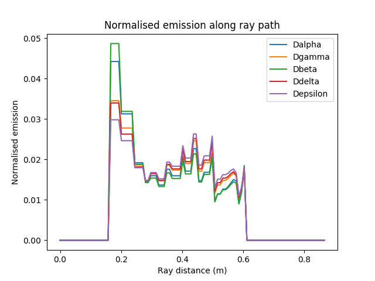

.. _balmer_series_spectra:

Measuring line of sight spectra
===============================

Cherab is capable of simulating spectroscopic measurements. In this example we
simulate a basic measurement of the balmer series in the MAST-U divertor with
an optical fibre.

By default, Raysect images are ray-traced to give line integrated spectra which
can sometimes be difficult to interpret without knowing the localisation
of the emission. Sometimes the emission can be highly localised, and other times
very diffuse. This example also shows some techniques for visualising the emission
locations and plasma parameters along the ray trajectory. The full demo file for
this tutorial can be downloaded from
`here <https://git.ccfe.ac.uk/cherab/cherab-core/tree/master/docs/demonstrations/line_emission/balmer_series.py>`_.
Start by importing all required modules and creating world. ::

    # External imports
    import os
    import numpy as np
    import matplotlib.pyplot as plt

    # Core and external imports
    from raysect.core import Vector3D, Point3D
    from raysect.core.ray import Ray as CoreRay
    from raysect.primitive.mesh import Mesh, import_stl
    from raysect.optical.material.absorber import AbsorbingSurface
    from raysect.optical.observer import FibreOptic, SpectralPipeline0D
    from raysect.optical import World, translate, rotate, rotate_basis

    # Cherab and raysect imports
    from cherab.atomic.core import Line
    from cherab.atomic.elements import deuterium, carbon
    from cherab_contrib.simulation_data.solps.solps_plasma import SOLPSSimulation
    from cherab.model.impact_excitation.pec_line import ExcitationLine, RecombinationLine
    from cherab_mastu.mast_cad_files import CENTRE_COLUMN, LOWER_DIVERTOR_ARMOUR

    plt.ion()
    world = World()

Loading Plasma and machine geometry
-----------------------------------

Load all parts of the machine mesh from files. In this example we only need the centre column
and divertor. ::

    MESH_PARTS = CENTRE_COLUMN + LOWER_DIVERTOR_ARMOUR

    for cad_file in MESH_PARTS:
        directory, filename = os.path.split(cad_file)
        name, ext = filename.split('.')
        print("importing {} ...".format(filename))
        Mesh.from_file(cad_file, parent=world, material=AbsorbingSurface(), name=name)

The core Plasma object will be populated from the output of a MAST-U SOLPS simulation. ::

    # Load plasma from SOLPS model
    mds_server = 'solps-mdsplus.aug.ipp.mpg.de:8001'
    ref_number = 69636
    sim = SOLPSSimulation.load_from_mdsplus(mds_server, ref_number)
    plasma = sim.plasma
    mesh = sim.mesh
    vessel = mesh.vessel

We will some lines from the Balmer series in our divertor example. These lines are
explained in another tutorial. ::

    # Setup deuterium lines
    d_alpha = Line(deuterium, 0, (3, 2), wavelength=656.19)
    d_beta = Line(deuterium, 0, (4, 2), wavelength=486.1)
    d_gamma = Line(deuterium, 0, (5, 2), wavelength=433.99)
    d_delta = Line(deuterium, 0, (6, 2), wavelength=410.2)
    d_epsilon = Line(deuterium, 0, (7, 2), wavelength=397)

    d_ion_species = plasma.get_species(deuterium, 1)
    d_atom_species = plasma.get_species(deuterium, 0)

    d_alpha_excit = ExcitationLine(d_alpha, plasma.electron_distribution, d_atom_species, inside_outside=plasma.inside_outside)
    d_alpha_excit.add_emitter_to_world(world, plasma)
    d_alpha_recom = RecombinationLine(d_alpha, plasma.electron_distribution, d_ion_species, inside_outside=plasma.inside_outside)
    d_alpha_recom.add_emitter_to_world(world, plasma)

    d_gamma_excit = ExcitationLine(d_gamma, plasma.electron_distribution, d_atom_species, inside_outside=plasma.inside_outside)
    d_gamma_excit.add_emitter_to_world(world, plasma)
    d_gamma_recom = RecombinationLine(d_gamma, plasma.electron_distribution, d_ion_species, inside_outside=plasma.inside_outside)
    d_gamma_recom.add_emitter_to_world(world, plasma)

    d_beta_excit = ExcitationLine(d_beta, plasma.electron_distribution, d_atom_species, inside_outside=plasma.inside_outside)
    d_beta_excit.add_emitter_to_world(world, plasma)
    d_beta_recom = RecombinationLine(d_beta, plasma.electron_distribution, d_ion_species, inside_outside=plasma.inside_outside)
    d_beta_recom.add_emitter_to_world(world, plasma)

    d_delta_excit = ExcitationLine(d_delta, plasma.electron_distribution, d_atom_species, inside_outside=plasma.inside_outside)
    d_delta_excit.add_emitter_to_world(world, plasma)
    d_delta_recom = RecombinationLine(d_delta, plasma.electron_distribution, d_ion_species, inside_outside=plasma.inside_outside)
    d_delta_recom.add_emitter_to_world(world, plasma)

    d_epsilon_excit = ExcitationLine(d_epsilon, plasma.electron_distribution, d_atom_species, inside_outside=plasma.inside_outside)
    d_epsilon_excit.add_emitter_to_world(world, plasma)
    d_epsilon_recom = RecombinationLine(d_epsilon, plasma.electron_distribution, d_ion_species, inside_outside=plasma.inside_outside)
    d_epsilon_recom.add_emitter_to_world(world, plasma)

Optical Fibre setup
-------------------

Setup an example MAST-U observation point with the `FibreOptic` observer class. ::

    # Fibre position and observation direction
    start_point = Point3D(1.669, 0, -1.6502)
    forward_vector = Vector3D(1-1.669, 0, -2+1.6502).normalise()
    up_vector = Vector3D(0, 0, 1.0)

    spectra = SpectralPipeline0D()
    fibre = FibreOptic([spectra], acceptance_angle=1, radius=0.001, spectral_bins=8000, spectral_rays=1,
                       pixel_samples=5, transform=translate(*start_point)*rotate_basis(forward_vector, up_vector), parent=world)

    fibre.min_wavelength = 350.0
    fibre.max_wavelength = 700.0

    fibre.observe()

.. figure:: ./balmer_series_spectra.png
   :align: center

   Balmer series spectrum measured with an optical fibre pointing into the
   MAST-U divertor.

Sampling plasma parameters along ray trajectory
-----------------------------------------------

The easiest way to understand the resulting spectra is to look at the predicted
emission and plasma parameters along the ray trajectory. Start by finding
the intersection point so that we can parameterise the ray trajectory with
a parametric line equation. ::

    # Find the next intersection point of the ray with the world
    intersection = world.hit(CoreRay(start_point, forward_vector))
    if intersection is not None:
        hit_point = intersection.hit_point.transform(intersection.primitive_to_world)
    else:
        raise RuntimeError("No intersection with the vessel was found.")

    # Traverse the ray with equation for a parametric line,
    # i.e. t=0->1 traverses the ray path.
    parametric_vector = start_point.vector_to(hit_point)
    t_samples = np.arange(0, 1, 0.01)

Next loop over the ray positions and sample the relevant parameters. ::

    # Setup some containers for useful parameters along the ray trajectory
    ray_r_points = []
    ray_z_points = []
    distance = []
    te = []
    ne = []
    dalpha = np.zeros(len(t_samples))
    dgamma = np.zeros(len(t_samples))
    dbeta = np.zeros(len(t_samples))
    ddelta = np.zeros(len(t_samples))
    depsilon = np.zeros(len(t_samples))

    # get the electron distribution
    electrons = plasma.electron_distribution

    # At each ray position sample the parameters of interest.
    for i, t in enumerate(t_samples):
        # Get new sample point location and log distance
        x = start_point.x + parametric_vector.x * t
        y = start_point.y + parametric_vector.y * t
        z = start_point.z + parametric_vector.z * t
        sample_point = Point3D(x, y, z)
        ray_r_points.append(np.sqrt(x**2 + y**2))
        ray_z_points.append(z)
        distance.append(start_point.distance_to(sample_point))

        # Sample plasma conditions
        te.append(electrons.effective_temperature(x, y, z))
        ne.append(electrons.density(x, y, z))

        # Log magnitude of emission
        dalpha[i] = d_alpha_excit.emission_at_point(x, y, z) + d_alpha_recom.emission_at_point(x, y, z)
        dgamma[i] = d_gamma_excit.emission_at_point(x, y, z) + d_gamma_recom.emission_at_point(x, y, z)
        dbeta[i] = d_beta_excit.emission_at_point(x, y, z) + d_beta_recom.emission_at_point(x, y, z)
        ddelta[i] = d_delta_excit.emission_at_point(x, y, z) + d_delta_recom.emission_at_point(x, y, z)
        depsilon[i] = d_epsilon_excit.emission_at_point(x, y, z) + d_epsilon_recom.emission_at_point(x, y, z)

Example plots
-------------

Here are some example plots that can be made with collected profiles. ::

    # Normalise the emission arrays
    dalpha /= dalpha.sum()
    dgamma /= dgamma.sum()
    dbeta /= dbeta.sum()
    ddelta /= ddelta.sum()
    depsilon /= depsilon.sum()

    # Plot the trajectory parameters
    sim.plot_pec_emission_lines([d_alpha_excit, d_alpha_recom], title='D_alpha')
    plt.plot(ray_r_points, ray_z_points, 'k')
    plt.plot(ray_r_points[0], ray_z_points[0], 'b.')
    plt.plot(ray_r_points[-1], ray_z_points[-1], 'r.')

    plt.figure()
    plt.plot(distance, te)
    plt.xlabel("Ray distance (m)")
    plt.ylabel("Electron temperature (eV)")
    plt.title("Electron temperature (eV) along ray path")

    plt.figure()
    plt.plot(distance, ne)
    plt.xlabel("Ray distance (m)")
    plt.ylabel("Electron density (m^-3)")
    plt.title("Electron density (m^-3) along ray path")

    plt.figure()
    plt.plot(distance, dalpha, label='Dalpha')
    plt.plot(distance, dgamma, label='Dgamma')
    plt.plot(distance, dbeta, label='Dbeta')
    plt.plot(distance, ddelta, label='Ddelta')
    plt.plot(distance, depsilon, label='Depsilon')
    plt.xlabel("Ray distance (m)")
    plt.ylabel("Normalised emission")
    plt.title("Normalised emission along ray path")
    plt.legend()

   D-alpha emission in the poloidal plane. The ray trajectory is overplotted with
   the start and end points indicated in blue and red respectively.

   Electron temperature from the plasma sampled along the ray trajectory.

   Electron density from the plasma sampled along the ray trajectory.

   Normalised balmer series emission plotted along the ray trajectory.

