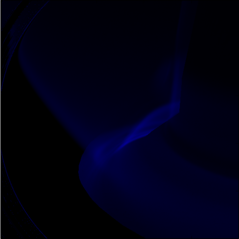

.. _mastu_forward_cameras:

MAST-U filtered cameras
=======================

Example of using SOLPS simulation and ADAS rates to model filtered cameras.
Start by importing all required modules and creating world. ::

   # Core and external imports
   import matplotlib.pyplot as plt
   from raysect.core import Vector3D, Point3D
   from raysect.optical import World, translate
   from raysect.optical.observer import VectorCamera
   from raysect.optical.observer import RGBPipeline2D, SpectralPipeline2D, PowerPipeline2D
   from raysect.primitive.mesh import import_stl
   from raysect.optical.material.lambert import Lambert
   from raysect.optical.material.absorber import AbsorbingSurface
   from raysect.optical.material.debug import Light as Debug
   from raysect.optical.spectralfunction import ConstantSF

   # Cherab and raysect imports
   from cherab.atomic.core import Line
   from cherab.atomic.elements import deuterium, carbon
   from cherab_contrib.jet.calcam import load_calcam_calibration
   from cherab_contrib.simulation_data.solps.solps_plasma import SOLPSSimulation
   from cherab.model.impact_excitation.pec_line import ExcitationLine, RecombinationLine

   plt.ion()
   world = World()

Loading machine geometry
------------------------

Load all parts of the machine mesh from files (either .stl or .obj). Each CAD files' optical properties are modified
by the chosen material:

* AbsorbingSurface - Acts as a perfect absorber. This class is useful for using the mesh geometry to restrict the plasma
  view, without including more advanced behaviour such as reflections.
* Lambert - a lambertian surface which takes the percentage reflectance as an argument. This material will include
  reflective effects and hence requires larger number of samples for sufficient accuracy.
* Debug - a useful material for debugging. Takes a vector as argument which specifies the direction of global
  illumination. All surfaces will be illuminated with a uniform light emitting in the direction of this vector.

::

   MESH_PARTS = ['/projects/cadmesh/mast/mastu-light/mug_centrecolumn_endplates.stl',
                 '/projects/cadmesh/mast/mastu-light/mug_divertor_nose_plates.stl']

   for path in MESH_PARTS:
       import_stl(path, parent=world, material=AbsorbingSurface())  # Mesh with perfect absorber
       # import_stl(path, parent=world, material=Lambert(ConstantSF(0.25)))  # Mesh with 25% Lambertian reflectance
       # import_stl(path, parent=world, material=Debug(Vector3D(0.0, 1.0, 0.0)))  # Mesh with debugging material

Loading plasma from SOLPS simulation
------------------------------------

The core Plasma object can be populated from the output of a SOLPS simulation. These simulations can be loaded from the
raw output files, or from the AUG MDSplus server. This example loads a SOLPS simulation from the AUG server. ::

    # Load plasma from SOLPS model
    mds_server = 'solps-mdsplus.aug.ipp.mpg.de:8001'
    ref_number = 69636
    sim = SOLPSSimulation.load_from_mdsplus(mds_server, ref_number)
    plasma = sim.plasma
    mesh = sim.mesh
    vessel = mesh.vessel

Setting up emission lines
-------------------------

The desired emission lines can be simulated by setting up an emission Line object. This specifies the species and
transition of interest. Rate coefficient data will be loaded from the ADAS database if the line identified is available
in the default ADAS ADF files. If no rate data is available, a user supplied ADF file can be used to populate the rate
coefficient curves. ::

    # Setup deuterium lines
    d_alpha = Line(deuterium, 0, (3, 2), wavelength=656.19)
    d_gamma = Line(deuterium, 0, (5, 2), wavelength=433.99)

    # Load both deuterium plasma species for use in rate calculations.
    d_ion_species = plasma.get_species(deuterium, 1)
    d_atom_species = plasma.get_species(deuterium, 0)

    # Load the Excitation and Recombination lines and add them as emitters to the world.
    d_alpha_excit = ExcitationLine(d_alpha, plasma.electron_distribution, d_atom_species,
                                   inside_outside=plasma.inside_outside)
    d_alpha_excit.add_emitter_to_world(world, plasma)
    d_alpha_recom = RecombinationLine(d_alpha, plasma.electron_distribution, d_ion_species,
                                      inside_outside=plasma.inside_outside)
    d_alpha_recom.add_emitter_to_world(world, plasma)

Two more examples of lines that could be added to the scene. ::

    # d-gamma
    d_gamma_excit = ExcitationLine(d_gamma, plasma.electron_distribution, d_atom_species,
                                   inside_outside=plasma.inside_outside)
    d_gamma_excit.add_emitter_to_world(world, plasma)
    d_gamma_recom = RecombinationLine(d_gamma, plasma.electron_distribution, d_ion_species,
                                      inside_outside=plasma.inside_outside)
    d_gamma_recom.add_emitter_to_world(world, plasma)

    # ciii_465
    ciii_465 = Line(carbon, 0, (11, 10), wavelength=465.01)
    ciii_species = plasma.get_species(carbon, 2)
    ciii_excit = ExcitationLine(ciii_465, plasma.electron_distribution, ciii_species, inside_outside=plasma.inside_outside, block=15)
    ciii_excit.add_emitter_to_world(world, plasma)

Filtered camera setup
---------------------

Camera geometry can be loaded from a CalCam calibration. The appropriate camera to use is the VectorCamera which takes
the pixel geometry as arguments.  ::

    # Select from available Cameras
    camera_config = load_calcam_calibration('./demo/mast/camera_configs/mug_bulletb_midplane.nc')
    # camera_config = load_calcam_calibration('./demo/mast/camera_configs/mug_divcam_isp.nc')
    # camera_config = load_calcam_calibration('./demo/mast/camera_configs/mug_divcam_sxd.nc')

    # Load RGB pipeline for visualisation
    rgb = RGBPipeline2D(display_unsaturated_fraction=0.96, name="sRGB")

    # Get the power and raw spectral data for scientific use.
    power_unfiltered = PowerPipeline2D(display_unsaturated_fraction=0.96, name="Unfiltered Power (W)")
    power_unfiltered.display_update_time = 15
    spectral = SpectralPipeline2D()

    # Setup camera for interactive use...
    pixels_shape, pixel_origins, pixel_directions = camera_config
    camera = VectorCamera(pixel_origins, pixel_directions,
                          pipelines=[rgb, power_unfiltered, spectral], parent=world)
    camera.spectral_bins = 15
    camera.pixel_samples = 1

    camera.observe()

If your simulation includes reflection effects. We recommend running the simulation in a loop and collecting lots of
samples. The simulation can be terminated manually when the required noise level has been reached. ::

    # Setup camera for batch run on cluster
    pixels_shape, pixel_origins, pixel_directions = camera_config
    camera = VectorCamera(pixel_origins, pixel_directions, pixels=pixels_shape, sensitivity=1E-34, parent=world)
    camera.spectral_samples = 15
    camera.pixel_samples = 50
    camera.display_progress = False
    camera.accumulate = True

    # start ray tracing
    for p in range(1, 5000):
        print("Rendering pass {} ({} samples/pixel)..."
              "".format(p, camera.accumulated_samples + camera.pixel_samples * camera.spectral_rays))
        camera.observe()
        camera.save("mastu_divcam_dalpha_{}_samples.png".format(camera.accumulated_samples))
        print()

Raw power and spectral data is available for further scientific use through the power and spectral pipelines. ::

    # Wavelength array
    spectral.wavelengths
    # Raw spectrum at pixel coordinate (250, 250)
    spectral.frame.mean[250, 250, :]

Example output images
---------------------

.. figure:: ./mastu_bulletb_midplane_dgamma.png
   :align: center

   D-gamma with the mid-plane bullet camera.

   C-III at 465nm with the X-point camera.

.. figure:: ./mastu_divcam_sxd_dalpha.png
   :align: center

   D-alpha in the Super-X configuration and viewed with the SXD camera.

.. figure:: ./mastu_divcam_sxd_dalpha_150_samples.png
   :align: center

   Repeat of the previous image. All previous simulations used the perfect AbsorbingSurface material to include geometry
   blocking effects. This simulation goes one step further, instead we are using a Lambertian material with 25%
   reflectance to simulate carbon tiles. This leads to a visable difference around the tile surfaces.
