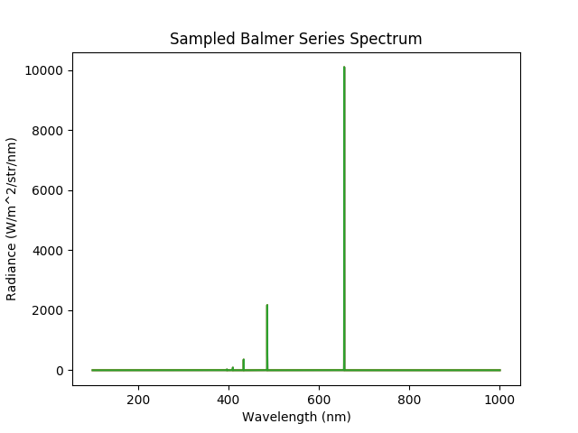
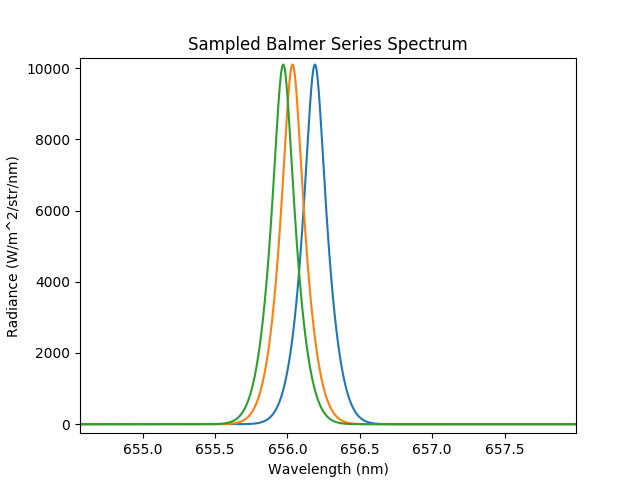

.. _impact_recom_lines:

Impact Excitation and Recombination
===================================

This demonstration shows how to model the commonly observed passive emission lines due
to electron impact excitation and recombination. A spherical plasma is initialised in
a similar way to other demonstrations on creating plasmas. Then the ExcitationLine()
and RecombinationLine() emission models for the first five Balmer series lines are
attached to the plasma.

.. literalinclude:: ../../../../demos/balmer_series.py

   **Caption:** The observed Balmer series spectrum.

   **Caption:** A zoomed in view on the h-alpha lines reveals the doppler shifts observable
   by varying the viewing angle.

.. figure:: BalmerSeries_camera.png
   :align: center
   :width: 450px

   **Caption:** A zoomed in spectral view of the commonly studied CVI n = 8->7 CXS line.
   The lines are doppler shifted due to the velocity of the plasma.

