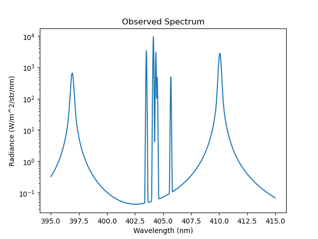
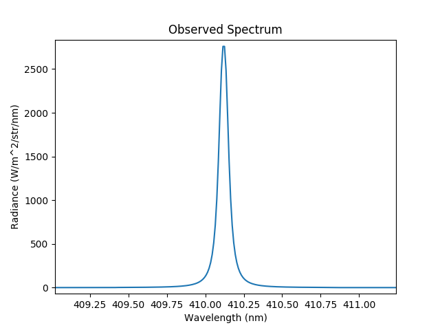

.. _stark_broadening:

Stark Broadening
================

Normally, the dominant factor in determining the lineshape is the thermal
doppler broadening. However, in certain high density plasma scenarios a
secondary effect can take over, known as pressure broadening. This effect
results from the fact that radiating ions experience a change in the
electric field due to the presence of neighbouring ions. In normal tokamak
operations this effect is negligible, except in the divertor region.

It is possible to override the default doppler broadened line shape by
specifying the StarkBroadenedLine() lineshape class. In this example
we can see two stark broadened balmer series lines surrounding a
Nitrogen II multiplet feature.

.. literalinclude:: ../../../../demos/emission_models/stark_broadening.py

   **Caption:** The observed spectrum with two stark broadened balmer lines
   (397nm and 410nm) surrounding a NII multiplet feature.

   **Caption:** A zoomed in view of the 410nm Balmer line revealing the
   characteristic stark broadened lineshape.
