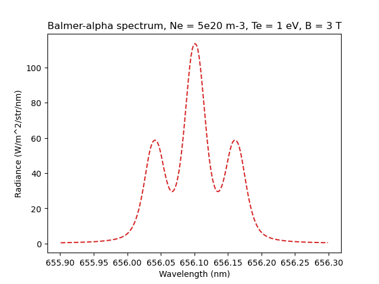
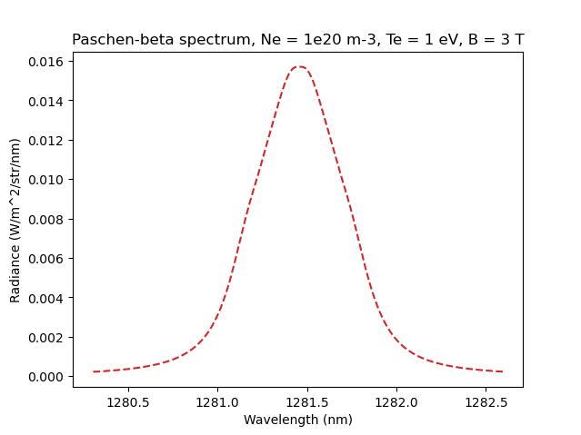

.. _stark_zeeman:

Stark-Zeeman line shape
=======================

In B. Lomanowski, et al. "Inferring divertor plasma properties from hydrogen Balmer
and Paschen series spectroscopy in JET-ILW." Nuclear Fusion 55.12 (2015)
`123028 <https://doi.org/10.1088/0029-5515/55/12/123028>`_ Stark and Zeeman features
are treated independently. This is a simplification and for better accuracy these effects
must be taken into account jointly as in J. Rosato, Y. Marandet, R. Stamm,
Journal of Quantitative Spectroscopy & Radiative Transfer 187 (2017)
`333 <https://doi.org/10.1016/j.jqsrt.2016.10.005>`_.

The StarkBroadenedLine() follows the Lomanowski's paper, but introduces a couple of additional
approximations:

* Zeeman splitting is taken in the form of a simple triplet with a :math:`\pi`-component
  centred at :math:`\lambda`, :math:`\sigma^{+}`-component at :math:`\frac{hc}{hc/\lambda -\mu B}`
  and :math:`\sigma^{-}`-component at :math:`\frac{hc}{hc/\lambda +\mu B}`.
* The convolution of Stark-Zeeman and Doppler profiles is replaced with the weighted sum
  to speed-up calculations (`pseudo-Voigt <https://en.wikipedia.org/wiki/Voigt_profile#Pseudo-Voigt_approximation>`_ approximation).

This example calculates Balmer-alpha and Paschen-beta Stark-Zeeman spectral lines
for the same parameters of plasma as in Figure 2 in Lomanowski's paper.

.. literalinclude:: ../../../../demos/emission_models/stark_zeeman.py

   **Caption:** The Stark-Zeeman structure of the Balmer-alpha line.

   **Caption:** The Stark-Zeeman structure of the Paschen-beta line.
