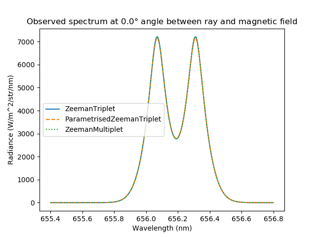

.. _zeeman_spectroscopy:

Zeeman Spectroscopy
===================

In the presence of magnetic field, spectral lines split into several components.
For high-resolution spectroscopy in magnetic confinement devices,
Zeeman effect must be taken into account. Ususally, Zeeman effect is used in
plasma diagnostics to determine spatial location of the radiation source, namely
high-field side scrape-off layer versus low-field side scrape-off layer.

Different Zeeman components have different polarisations, so-called :math:`\pi`-
and :math:`\sigma`-polarised components. Therefore, the observed spectrum depends
on the angle between the direction of observation and the magnetic field.
When observed along the magnetic field direction, only :math:`\sigma`-polarised
components are visible.

Cherab contains the following models of Zeeman line shapes.

* ``ZeemanTriplet`` model can be used in the case when the magnetic field is
  strong enough to disrupt the coupling between orbital and spin angular momenta
  of the electron (Paschen–Back effect).
  
* ``ParametrisedZeemanTriplet`` should be used when the Paschen–Back effect is stil
  observed, but the broadening due to the line's fine structure cannot be ignored.
  See A. Blom and C. Jupén, Parametrisation of the Zeeman effect for hydrogen-like
  spectra in high-temperature plasmas, Plasma Phys. Control. Fusion 44 (2002)
  `1229-1241 <https://doi.org/10.1088/0741-3335/44/7/312>`_.

* In all other cases, the general ``ZeemanMultiplet`` model must be used. The input
  data for this model can be obtained with the
  `ADAS603 <https://www.adas.ac.uk/man/chap6-03.pdf>`_ subroutines.

In case of :math:`D_{\alpha}` spectral line, all three models give the same results.
This demo shows how the spectrum depends on the angle between the
direction of observation and the magnetic field.

.. literalinclude:: ../../../../demos/emission_models/zeeman_splitting.py

   **Caption:** The :math:`D_{\alpha}` spectrum observed along the magnetic field.

   **Caption:** The :math:`D_{\alpha}` spectrum observed at :math:`45^{\circ}`
   angle between the direction of ray and the magnetic field.

.. figure:: zeeman_spectrum_90deg.png
   :align: center
   :width: 450px

   **Caption:** The :math:`D_{\alpha}` spectrum observed perpendicularly to the magnetic
   field.
