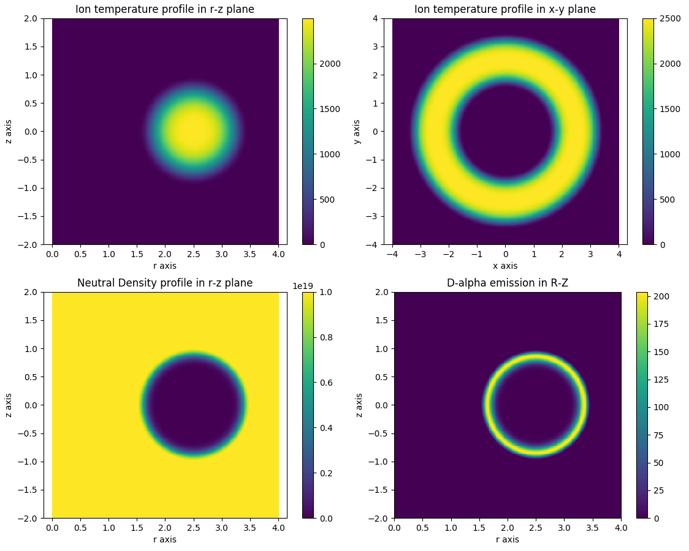
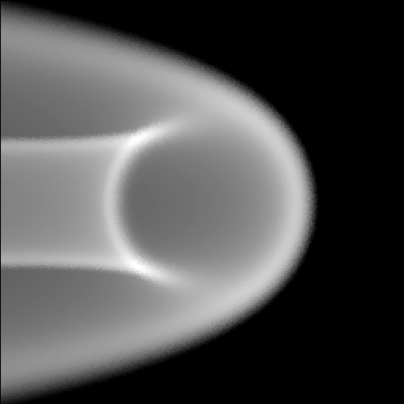

.. _analytic_function_plasma:

Analytic Function Plasma
========================

This demonstration shows how to define a set of plasma distributions using analytic functions.
Each function must by implemented as a python callable. The rest of the code
shows how to use these functions in a plasma and visualises the results.

Note that while it is possible to use pure python functions for development, they are typically
~100 times slower than their cython counterparts. Therefore, for use cases where speed is important
we recommend moving these functions to cython classes. For an example of a cython function,
see the `Gaussian <https://github.com/cherab/core/blob/master/demos/gaussian_volume.pyx>`_
cython class in the demos folder.

.. literalinclude:: ../../../../demos/plasmas/analytic_plasma.py

