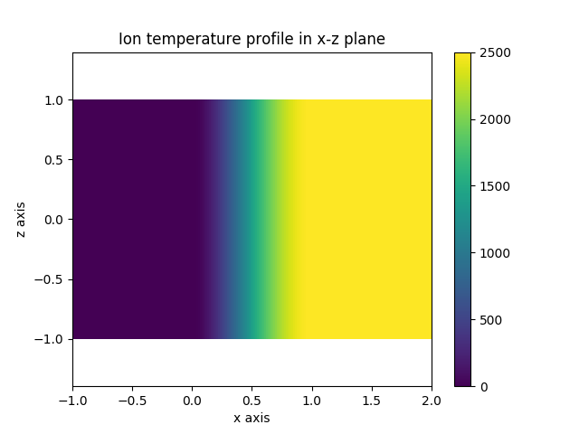
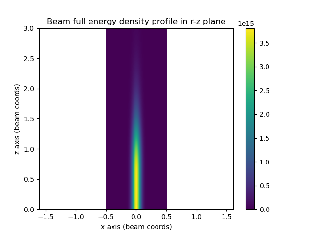
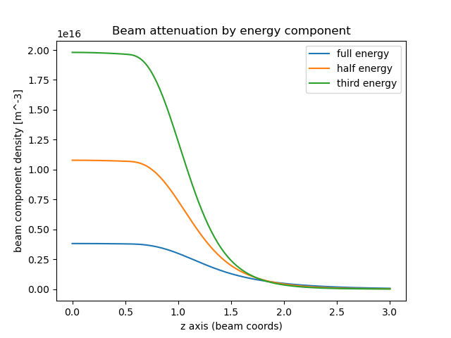

.. _beams_into_plasmas:

Beams into plasmas
==================

This demonstration shows how to define a mono-energetic neutral particle beam that interacts
with a plasma. Beams such as these are commonly used in fusion plasmas for power injection
and current drive, usually abbreviated as NBI.

In this demo we create a slab of plasma that has a pedestal starting at x=0 in the y-z plane.
The pedestal extends for some defined length before reaching a flat top for x>pedestal_length.
We then define a beam composed of three different energy components. The rest of the code
visualises the results.

.. literalinclude:: ../../../../demos/plasmas/beam_into_slab.py

   **Caption:** The ion temperature profile in our slab plasma.

.. figure:: beam_neutral_temp.png
   :align: center
   :width: 450px

   **Caption:** The neutral temperature profile in our slab plasma.

   **Caption:** A plot of the full energy component beam density along
   the beam axis in the x-z plane. Note that the coordinates here are
   in the beam's local coordinate system.

   **Caption:** A plot of the beam attenuation for each of the beam energy
   components along the beam axis. Note these are plotted in local beam
   coordinates. So the beam origin is at the origin coordinate (0, 0, 0)
   and the beam axis is aligned along the z-axis.

   **Caption:** A camera observation of the charge exchange CVI 8->7 line.
