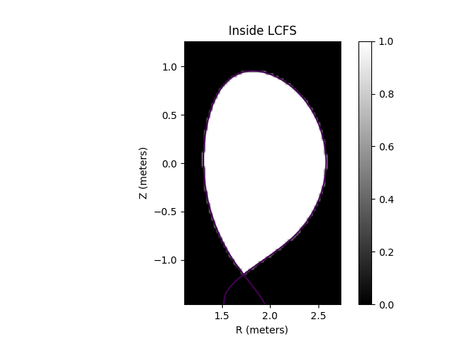

.. _flux_function_plasmas:

Flux Function Plasmas
=====================

It is a common use case to approximate the core plasma of a tokamak with 1D flux
functions. For example, we might assume the electron temperature can be defined
as a 1D profile function of :math:`\psi_n`, i.e. is constant on flux surfaces.
This demonstration shows how to define plasma distributions in terms of 1D
flux functions using the EFITEquilibrium's mapping utilities.

The :class:`~cherab.tools.equilibrium.efit.EFITEquilibrium` class is the workhorse class
for working with tokamak equilibria in Cherab. To use equilibria in your code you
should extract the appropriate data from your equilibrium code of choice and instantiate
this class directly for a given time slice. We include an example equilibrium with the
Cherab tools module for the tutorials and experimentation.

.. literalinclude:: ../../../../demos/equilibrium/equilibrium.py

.. figure:: equilibrium_surfaces.png
   :align: center

   **Caption:** The flux surfaces of the example equilibrium.

   **Caption:** The Last Closed Flux Surface (LCFS) polygon mask.

.. figure:: equilibrium_limiter.png
   :align: center

   **Caption:** The limiter polygon mask.

.. figure:: equilibrium_mapped_te_xz.png
   :align: center

   **Caption:** A slice of the electron temperature through the x-z plane
   revealing Te as a flux quantitiy.

.. figure:: equilibrium_mapped_te_xy.png
   :align: center

   **Caption:** A slice of the electron temperature through the x-y plane.
