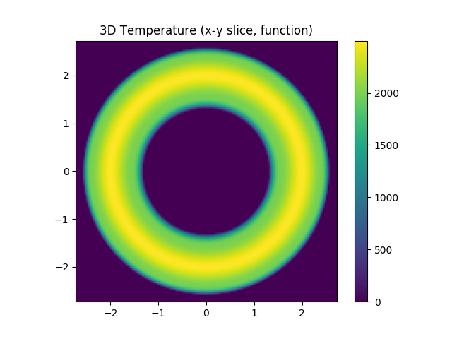

.. _flux_function_plasmas:

Flux Function Plasmas
=====================

It is a common use case to approximate the core plasma of a tokamak with 1D flux
functions. For example, we might assume the electron temperature can be defined
as a 1D profile function of :math:`\psi_n`, i.e. is constant on flux surfaces.
This demonstration shows how to define plasma distributions in terms of 1D
flux functions using the EFITEquilibrium's mapping utilities.

.. code-block:: pycon

   >>> import matplotlib.pyplot as plt
   >>> 
   >>> from cherab.core.math import sample2d, Slice3D, Interpolate1DCubic
   >>> 
   >>> # Get a JET plasma EFITEquilibrium object
   >>> from cherab.jet import JETEquilibrium
   >>> equilibria = JETEquilibrium(91693)
   >>> equilibrium = equilibria.time(55.0)
   >>> 
   >>> # The equilibrium object includes methods for mapping functions onto the
   >>> flux surfaces.
   >>> # These create 2D or 3D functions or e.g. temperature, density etc...
   >>> according to the profile being mapped.
   >>> # The user can supply either a python function (with 1 argument -
   >>> normalised psi), a Function1D object or a numerical
   >>> # array holding the normalised psi and function values.
   >>> 
   >>> # In this example we create fake 2D and 3D "temperature" profiles from
   >>> an array of data.
   >>> # The array is interpolated with cubic interpolation and then mapped
   >>> onto the normalised psi grid.
   >>> temperature_3d = equilibrium.map3d([[0, 0.5, 0.9, 1.0], [5000, 4000,
   >>> 2000, 0]])
   >>> 
   >>> 
   >>> # display 3D temperature
   >>> 
   >>> rmin, rmax = equilibrium.r_range
   >>> zmin, zmax = equilibrium.z_range
   >>> nr = round((rmax - rmin) / 0.025)
   >>> nz = round((zmax - zmin) / 0.025)
   >>> temperature_slicez = Slice3D(temperature_3d, axis='z', value=0.0)
   >>> x, y, temperature_grid = sample2d(temperature_slicez, (-rmax, rmax, nr),
   >>> (-rmax, rmax, nr))
   >>> 
   >>> plt.figure()
   >>> plt.axes(aspect='equal')
   >>> plt.pcolormesh(x, y, temperature_grid.transpose(), shading='gouraud')
   >>> plt.autoscale(tight=True)
   >>> plt.colorbar()
   >>> plt.title('3D Temperature (x-y slice)')
   >>> 
   >>> 
   >>> rmin, rmax = equilibrium.r_range
   >>> zmin, zmax = equilibrium.z_range
   >>> nr = round((rmax - rmin) / 0.025)
   >>> nz = round((zmax - zmin) / 0.025)
   >>> temperature_slicey = Slice3D(temperature_3d, axis='y', value=0.0)
   >>> x, z, temperature_grid = sample2d(temperature_slicey, (rmin, rmax, nr),
   >>> (zmin, zmax, nz))
   >>> 
   >>> plt.figure()
   >>> plt.axes(aspect='equal')
   >>> plt.pcolormesh(x, z, temperature_grid.transpose(), shading='gouraud')
   >>> plt.autoscale(tight=True)
   >>> plt.colorbar()
   >>> plt.title('3D Temperature (x-z slice)')
   >>> 
   >>> plt.show()

.. figure:: equilibrium_mapped_te_xz.png
   :align: center
   :width: 450px

   **Caption:** A slice of the electron temperature through the x-z plane
   revealing Te as a flux quantitiy.

   **Caption:** A slice of the electron temperature through the x-y plane.

