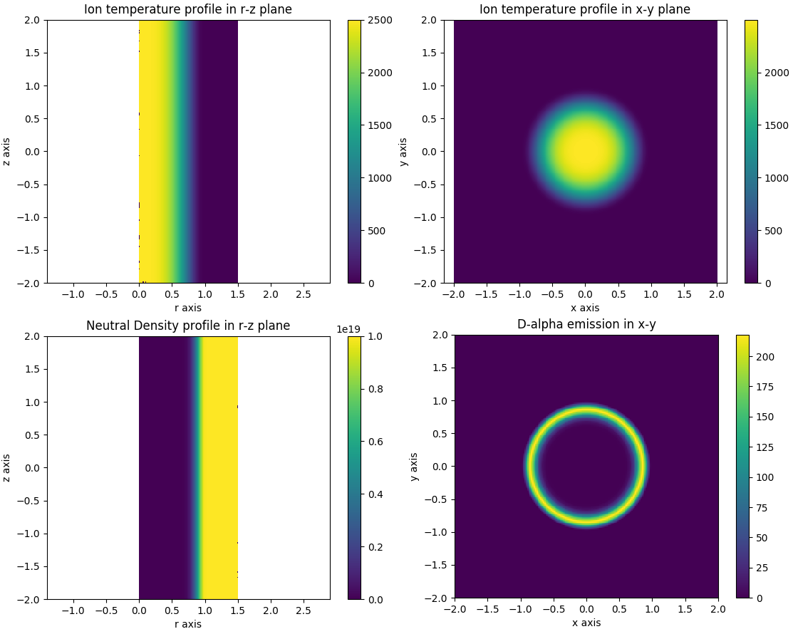
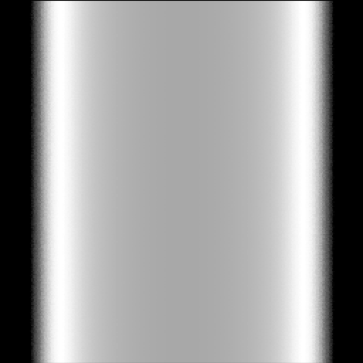

.. _mesh2d_plasma:

2D Mesh Plasmas
===============

This demonstration shows how to define a set of plasma distributions using 2D meshes
that are revolved around the z-axis. This use case is commonly encountered when we
already have a plasma solution that has been computed with a fluid code or
particle-in-cell code. These codes typically export their plasma solutions on a mesh
in a 2D plane, assuming a symmetry axis. The plasma values are defined either
at the mesh vertices or inside the cells.

These types of plasmas can be achieved in Cherab with Raysect's mesh interpolators,
`Discrete2DMesh <https://raysect.github.io/documentation/api_reference/core/functions.html#raysect.core.math.interpolators.discrete2dmesh.Discrete2DMesh>`_
and `Interpolator2DMesh <https://raysect.github.io/documentation/api_reference/core/functions.html#raysect.core.math.interpolators.interpolator2dmesh.Interpolator2DMesh>`_.
Both mesh functions are defined on a triangular mesh. The mesh vertex coordinates and
triangle definitions are given as arguments. The Discrete2DMesh defines it's values
as constant inside each triangle, with the triangle values supplied as an argument.
The Interpolator2DMesh takes values defined at the triangle vertices and performs
Barycentric interpolation within each triangle. Both 2D mesh functions can be
promoted to 3D functions with the AxisymmetricMapper class, which maps a 2D r-z
function around the z-axis.

In this example we create a simple triangular mesh from scratch and sample some
analytic functions describing a cylindrically symmetric plasma column at the mesh
vertices. However, in real use cases you would use the mesh description
supplied by the plasma simulation code.

.. literalinclude:: ../../../../demos/plasmas/mesh_plasma.py

   **Caption:** Visualisation plots of slices through the plasma.

   **Caption:** A camera rendering of the d-alpha light from the cylindrically symmetric
   plasma column.

.. figure:: mesh_for_plasma.png
   :align: center
   :width: 450px

   **Caption:** A visualisation of the underlying triangular mesh in the r-z plane. The
   plasma values were defined at the triangle vertices.
