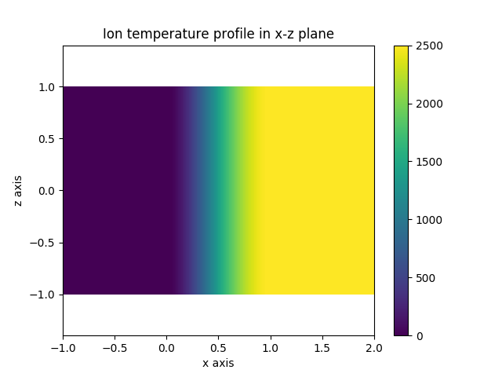
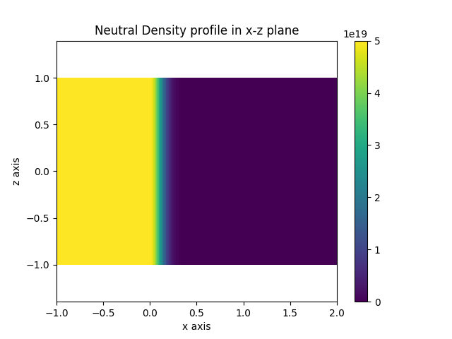

.. _slab_plasma:

Slab Plasma
===========

This demonstration uses the  utility function
:meth:`~cherab.tools.plasmas.slab.build_slab_plasma` to assemble a slab of plasma
defined along the positive x axis. It is a useful tool for defining a simple plasma
to be used in the testing of emission models.

.. literalinclude:: ../../../../demos/plasmas/slab_plasma.py

   **Caption:** The ion temperature profile with a pedestal starting at x=0.

   **Caption:** The neutral density profile, constant for x<0 and then attenuated
   by the plasma.
