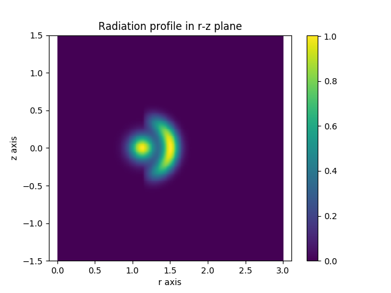
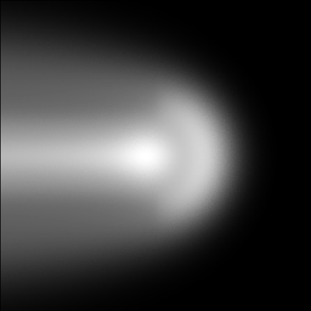

.. _radiation_function:

Defining A Radiation Function
=============================

When calculating surface radiation loads on reactor components it is necessary
to define a radiation function. This could be some output from a physics code,
or perhaps an analytic function. In Cherab, the source function will always be
prescribed as a 3D function regardless of the data source.

All emission models in Cherab and Raysect are fully spectral. It is possible to
create arbitrary radiation functions using the Material interface in Raysect.
However it is often sufficient to specify a simple total radiated power
function in terms of W/m^2 for many physics applications. In such cases, the
:class:`~cherab.tools.emitters.radiation_function.RadiationFunction` utility
material is particularly useful.

In this example we give it a user specified python function that specifies the
emission, and attach it to a cylinder. The surface of the cylinder is
transparent, but its volume emits proportional to the specified function. Note
that the radiation function is evaluated in the local coordinate system of the
primitive to which the material is attached. In this example we create a
cylinder which is shifted in the Z direction, but we want to evaluate the
radiation function in the unshifted "global" coordinate system. For this we can
use raysect's `VolumeMaterial` material modifier.

.. literalinclude:: ../../../../demos/radiation_loads/radiation_function.py

   **Caption:** A slice through the specified 3D emission function in the R-Z plane..

   **Caption:** A camera visualiation of the emission function. Notice that
   the bounding cylinder is transparent so there are effectively no walls.
   The emission function is defined inside the bounding cylinder and zero
   everywhere else.
