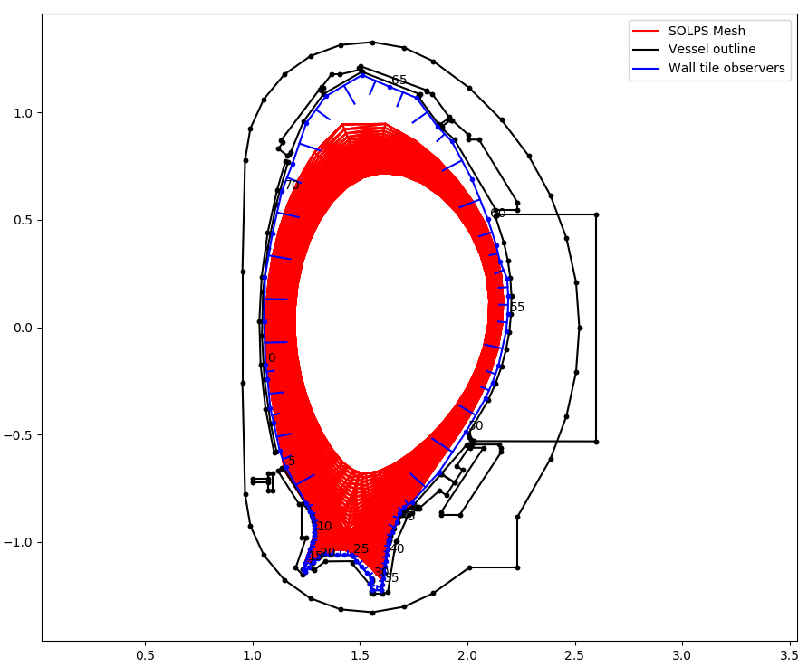

.. _aug_solps_radiation_load:

Calculating wall surface radiation loads
========================================

In this example we ray-trace the total radiated power from a SOLPS simulation
and use rectangular observers wrapping around the machine wall to calculate a
radiation power profile wrapping around the machine. The full demo file for
this tutorial can be downloaded from
`here <https://git.ccfe.ac.uk/cherab/cherab-core/tree/master/docs/demonstrations/radiation_wall_loads/wall_radiation.py>`_.
Start by importing all required modules and creating world. ::

    # External imports
    import os
    import time
    import matplotlib.pyplot as plt
    import numpy as np
    from math import sqrt, pi

    # Raysect imports
    from raysect.core.workflow import SerialEngine
    from raysect.core import translate, rotate_basis
    from raysect.optical import World
    from raysect.optical.observer.nonimaging.pixel import Pixel
    from raysect.optical.observer import PowerPipeline0D
    from raysect.primitive.mesh import Mesh
    from raysect.optical.material.absorber import AbsorbingSurface

    # Cherab imports
    from cherab_extra.simulation_data.solps.models.radiated_power import solps_total_radiated_power
    from cherab_extra.simulation_data.solps.solps_plasma import SOLPSSimulation
    from cherab_aug.integrated_power.wall_detector_geometry import aug_wall_detectors

    world = World()

    plt.ion()
    world = World()

Loading Plasma and machine geometry
-----------------------------------

Load all parts of the machine mesh from files. We are using a perfect absorbing surface so that
no emission will be reflected. ::

    MESH_PATH = '/projects/cadmesh/aug/'

    # Load all parts of mesh with chosen material
    MESH_PARTS = ['vessel_s02-03.rsm', 'vessel_s04-05.rsm', 'vessel_s06-07.rsm', 'vessel_s08-09.rsm',
                  'vessel_s10-11.rsm', 'vessel_s12-13.rsm', 'vessel_s14-15.rsm', 'vessel_s16-01.rsm',
                  'divertor_s02-03.rsm', 'divertor_s04-05.rsm', 'divertor_s06-07.rsm', 'divertor_s08-09.rsm',
                  'divertor_s10-11.rsm', 'divertor_s12-13.rsm', 'divertor_s14-15.rsm', 'divertor_s16-01.rsm',
                  'inner_heat_shield_s01.rsm', 'inner_heat_shield_s02.rsm', 'inner_heat_shield_s03.rsm',
                  'inner_heat_shield_s04.rsm', 'inner_heat_shield_s05.rsm', 'inner_heat_shield_s06.rsm',
                  'inner_heat_shield_s07.rsm', 'inner_heat_shield_s08.rsm', 'inner_heat_shield_s09.rsm',
                  'inner_heat_shield_s10.rsm', 'inner_heat_shield_s11.rsm', 'inner_heat_shield_s12.rsm',
                  'inner_heat_shield_s13.rsm', 'inner_heat_shield_s14.rsm', 'inner_heat_shield_s15.rsm',
                  'inner_heat_shield_s16.rsm']

    machine_material = AbsorbingSurface()  # Mesh with perfect absorber

    for path in MESH_PARTS:
        path = MESH_PATH + path
        print("importing {}  ...".format(os.path.split(path)[1]))
        directory, filename = os.path.split(path)
        name, ext = filename.split('.')
        Mesh.from_file(path, parent=world, material=machine_material, name=name)

The core Plasma object will be populated from the output of a AUG SOLPS simulation, this example
provided by Felix Reimold (2016). The simulation can be loaded from the AUG MDSplus server
or locally from files. ::

    # Load simulation from MDSplus
    mds_server = 'solps-mdsplus.aug.ipp.mpg.de:8001'
    ref_number = 40195
    sim = SOLPSSimulation.load_from_mdsplus(mds_server, ref_number)

    # Load simulation from raw output files
    # SIM_PATH = '/home/mcarr/mst1/aug_2016/solps_testcase/'
    # sim = SOLPSSimulation.load_from_output_files(SIM_PATH)

    plasma = sim.plasma
    mesh = sim.mesh
    plasma_cylinder = solps_total_radiated_power(world, sim, step=0.001)

Description of wall tile observers
----------------------------------

Even though we are using the full CAD files for ray-tracing effects such as
occlusion and shadowing, we will use a simplified wall surface as the
observing surface.

The observing surface will be 1cm wide and covering a complete poloidal cross
section of the machine. Each wall element will be a rectangle with x-width=1cm
and a y-width that varies poloidally depending on the detail level required in
that part of the machine. For example, the observing tiles might need to be
much small in the divertor region where radiation gradients are much steeper.

For every tile the minimum description needed is the (xwidth, ywidth) dimensions,
a Point3D indicating the centre point of the tile, a surface normal vector, and
a y-axis vector. An example description could be a list like this: ::

    # (detector index, xwidth, ywidth, centre_point, normal_vector, y_vector)
    aug_wall_detectors = [
        (0, 0.01, 0.2027, Point3D(1.0566, 0.0, -0.072559),
         Vector3D(0.99958, 0.0, 0.028904), Vector3D(0.028904, 0.0, -0.99958)),
        (1, 0.01, 0.06912, Point3D(1.0647, 0.0, -0.20806),
         Vector3D(0.98882, 0.0, 0.14913), Vector3D(0.14913, 0.0, -0.98882)),
        (2, 0.01, 0.1362, Point3D(1.0761, 0.0, -0.31002),
         Vector3D(0.99575, 0.0, 0.092117), Vector3D(0.092117, 0.0, -0.99575)),
         ...
    ]

   Example wall observation geometry for AUG shown in blue. Surface normals indicated.

.. figure:: ./AUG_wall_zoomed.png
   :align: center

   Zoomed in view of the wall observation geometry for AUG in the divertor. Note,
   observing surface can be very close but must not overlap the CAD files. Otherwise
   radiation is absorbed by the CAD surface instead of the observing surface.

For each tile in the list of wall tiles, setup the tile as a `Pixel` observer class.
These pixels are rectangular surfaces with arbitrary orientation. Random sample points
and vectors are generated across the rectangular surface to cover the full etendue of
the tile. ::

    # Storage lists for results
    powers = []
    power_errors = []
    detector_numbers = []
    distance = []

    X_WIDTH = 0.01  # x-width is constant 1cm
    running_distance = 0
    cherab_total_power = 0

    # Loop over each tile detector
    for i, detector in enumerate(aug_wall_detectors):

        print()
        print("detector {}".format(i))

        # extract the dimensions and orientation of the tile
        y_width = detector[2]
        centre_point = detector[3]
        normal_vector = detector[4]
        y_vector = detector[5]
        pixel_area = X_WIDTH * y_width

        # Use the power pipeline to record total power arriving at the surface
        power_data = PowerPipeline0D()

        # Create a affine transform matrix to correctly orientate the tile
        pixel_transform = translate(centre_point.x, centre_point.y, centre_point.z) * rotate_basis(normal_vector, y_vector)
        # Use pixel_samples argument to increase amount of sampling and reduce noise
        pixel = Pixel([power_data], x_width=X_WIDTH, y_width=y_width, name='pixel-{}'.format(i),
                      spectral_bins=1, transform=pixel_transform, parent=world, pixel_samples=500)

        # Start collecting samples
        pixel.observe()

        # Append the collected data to the storage lists
        powers.append(power_data.value.mean / pixel_area)  # convert to W/m^2
        power_errors.append(power_data.value.error() / pixel_area)
        detector_numbers.append(i)

        # Calculate the current poloidal distance around the machine
        running_distance += 0.5*y_width
        distance.append(running_distance)
        running_distance += 0.5*y_width

        # For checking energy conservation.
        # Revolve this tile around the cylindrical z-axis to get total power collected by these tiles.
        # Add up all the tile contributions to get total power collected.
        pixel_radius = sqrt(centre_point.x**2 + centre_point.y**2)
        cherab_total_power += power_data.value.mean * y_width * 2 * pi * pixel_radius

.. figure:: ./AUG_radiation_load.png
   :align: center

   Example plot of radiation power loading around the machine walls.

Checking for energy conservation
--------------------------------

We can check that energy is being conserved by looping over each cell in the SOLPS simulation and adding
up its power to find the total power emitted in the simulation. Total radiated power should equal total
power collected on the walls. ::

    total_rad_data = sim.total_rad_data
    vol = mesh.vol
    radius = mesh.cr

    solps_total_power = 0
    for i in range(mesh.nx):
        for j in range(mesh.ny):
            solps_total_power += total_rad_data[i, j] * vol[i, j]

    print("Cherab total radiated power => {:.4G} W".format(cherab_total_power))
    print("SOLPS total radiated power => {:.4G} W".format(solps_total_power))
