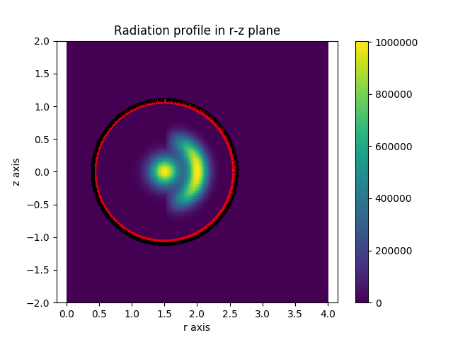
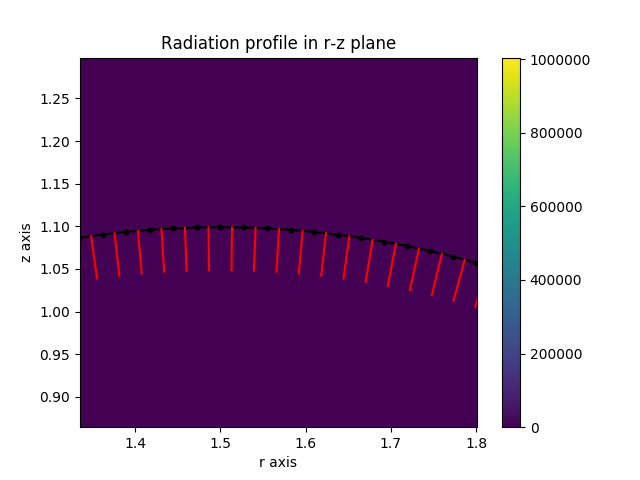
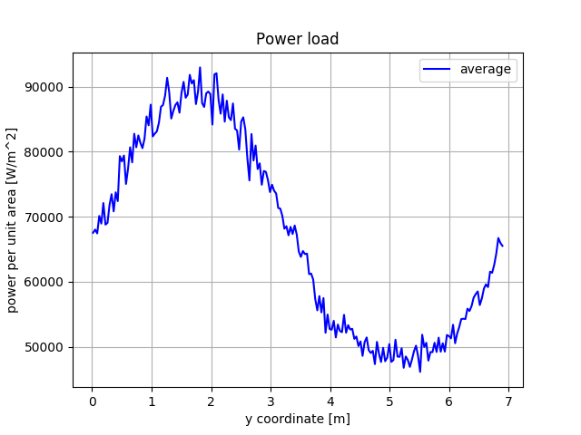

.. _symmetric_power_load:

Symmetric Power Load Calculation
================================

In this example we perform a simple radiation load calculation by exploiting
symmetry, building on the previous examples. We use an analytic
:ref:`radiation function <radiation_function>` combined with a simple
:ref:`toroidal wall <wall_from_polygon>`. The actual wall detectors are
constructed manually using the Raysect Pixel detector class.

.. Note::
   Observing surface are transparent in Raysect. Rays are launched from these
   surfaces, but Ray's don't collide with them. If you want them to act as
   absorbers you need to separately add an absorbing surface. To avoid numerical
   issues, its important that these surfaces are slightly displaced. If they
   overlap, some rays will become trapped within the surface due to numerical
   rounding, leading to faulty calculations. Its best to separate these surfaces
   with some small numerical scale length.

.. literalinclude:: ../../../../demos/radiation_loads/symmetric_power_load.py

When this script is run, the output confirms power is conserved.

    >>> python symmetric_power_load.py
    Total radiated power => 4.848 MW
    Cherab total detected power => 4.844 MW

   **Caption:** The emission source function with the wall detector positions
   overlaid.

   **Caption:** A zoomed in view of the wall detectors (black) and their surface
   normals (red).

   **Caption:** The power loading in MW/m^2 measured on the pixel detectors wrapping
   around the wall.
