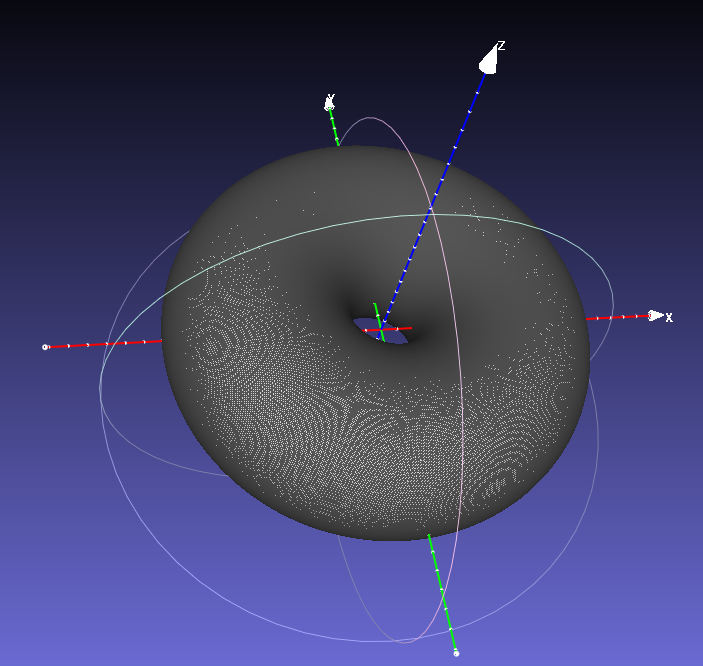

.. _wall_from_polygon:

Defining A Wall From A 2D Polygon
=================================

When studying candidate reactor designs for future machines, detailed engineering
meshes are not always available. Sometimes all we have is a simple 2D outline
representing a candidate wall design.

In this example we make a 3D mesh from a simple outline. The wall mesh is intended
to wrap the plasma emission function from the previous
:ref:`radiation function example <radiation_function>`. The utility function
:meth:`~cherab.tools.primitives.axisymmetric_mesh.axisymmetric_mesh_from_polygon`
is useful for creating a 3D mesh from a 2D polygon.

.. literalinclude:: ../../../../demos/radiation_loads/wall_from_polygon.py

   **Caption:** The resulting toroidal mesh visualised in Meshlab.
