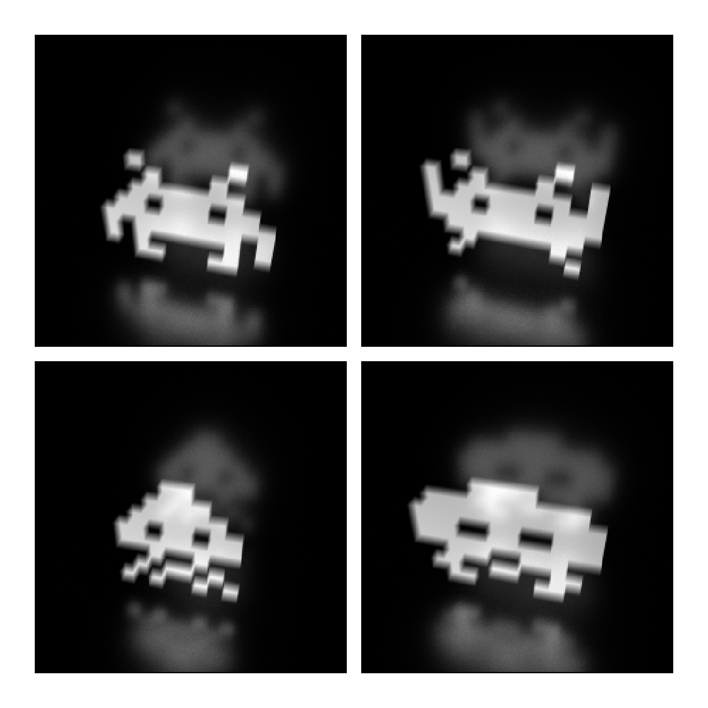

.. _ray_transfer_box:

Rectangular regular grid
========================

This example shows how to:

 * calculate ray transfer matrix (geometry matrix) for a rectangular emitter defined on a regular grid,
 * obtain images using calculated ray transfer matrix by collapsing it with various emission profiles.

Notice that `RoughNickel` material is imported from cherab.tools.raytransfer and not from raysect.optical.library.

.. literalinclude:: ../../../../demos/ray_transfer/1_ray_transfer_box.py

   **Caption:** The result of collapsing geometry matrix with four different emission profiles.
