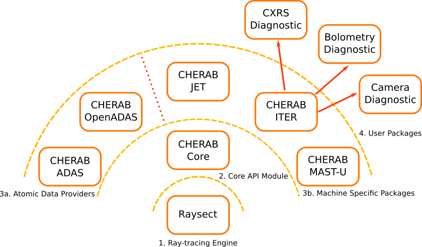

==================================
Installation and Project Structure
==================================

Prerequisites
~~~~~~~~~~~~~

The Cherab package requires Python 3.5+, numpy, scipy, matplotlib and `Raysect <https://www.raysect.org>`_.
Scipy version 0.13 or higher is recommended. IPython is recommended for interactive use.

Project Structure
~~~~~~~~~~~~~~~~~

Cherab is a large code framework consisting of a main core package and many smaller feature
packages. The overall structure of the framework is best visualised as onion shells. The full
project structure is most relevant for researchers in fusion plasma physics. Researchers in other
areas such as industrial plasmas and astrophysics will only require layers 1, 2 for their
applications.

   **Caption:** A high level diagram illustrating the structure of the Cherab framework.

**1. Ray-tracing Engine:** Cherab was built on top of a ray-tracing engine to provide all the core
ray-tracing functionality, mesh handling, etc. `Raysect <https://www.raysect.org>`_ is currently
the only ray-tracing engine supported, but the framework has been designed such that this
component is interchangeable. Support for other ray-tracers may be added in the future.

**2. Core API Module:** The `cherab <https://pypi.org/project/cherab>`_ package defines
all the API interfaces for the whole framework. It defines all the core functionality such
as: how plasmas are defined and the properties that can be computed from them; the types of
atomic data that can be used in spectroscopic calculations; and the types of plasma emission
that Cherab can calculate. This package is strictly managed by the Cherab development team.

**3a. Atomic Data Providers:** Almost all of the plasma emission models implemented in Cherab
require some type of atomic data for their calculations. The base types of reaction rates and
photon emissivity coefficients are defined in the Core API Module,
`cherab <https://pypi.org/project/cherab>`_. A default atomic data source module based on
 the `OpenADAS project <http://open.adas.ac.uk/>`_, is included in the package. In future
other atomic data sources, such as the ALADDIN database for example, could be made available
through additional packages.

**3b. Machine Specific Packages:** These components are for functionality associated with
a specific fusion experiment. For example, each experiment tends to have its own systems
for loading and saving experiment/simulation data. These packages allow the local facility
experts to provide models and diagnostic settings that are unique to their experiments.

**4. User Packages:** This is the layer where most Cherab users will do their work.
Code in this layer will usually take the form of scripts configured for a particular
analysis pipeline such as performing a synthetic diagnostic simulation or fitting some
measured data. These projects may just be collections of scripts owned by diagnostic
responsible officers or they could be organised into formal packages.

Installation
~~~~~~~~~~~~

Users will generally just install the core package and the specific feature packages they
need for their work. For example, users working on the JET tokamak will require the
`cherab <https://pypi.org/project/cherab>`_ package and the `cherab-jet <https://github.com/cherab/jet>`_
package. The core ``cherab`` package is available through pip. The additional fusion specific
packages, offering extra functionality, should be cloned from their respective repositories.

Installing through Pip
^^^^^^^^^^^^^^^^^^^^^^

Cherab is available from the python package repository `pypi <https://pypi.org/project/cherab>`_.
Unless developing new code for a cherab package, most users should use the latest versioned release
packages available through pypi.

The easiest way to install Cherab with OpenADAS is using `pip <https://pip.pypa.io/en/stable/>`_::

    pip install cherab

This will either install a binary package or build Cherab from source (which may take some time).
If you don't have administrator access to install the packages, add the ``--user`` flag to the above
line to install the packages under your own user account.

Installing from source
^^^^^^^^^^^^^^^^^^^^^^

If pip is not available the source files can be downloaded from `pypi <https://pypi.org/project/cherab>`_
or from our `development repository <https://github.com/cherab/core>`_. Once you have the source files,
locate the folder containing setup.py and run::

    python setup.py install

If all the required dependencies are present (cython, numpy, scipy, matplotlib and raysect), this should
start the Cherab compilation and installation process. If you don't have administrator access to install
the package, add the ``--user`` flag to the above line to install the package under your own user account.

When developing cherab it is usually preferred that the packages be installed in "develop" mode::

    python setup.py develop

This will cause the original installation folder to be added to the site-package path. Modifications to
the code will therefore be visible to python next time the code is imported. The ``--user`` flag should be
used if you do not have administrative permission for your python installation.

As all the Cherab packages are dependent on the core ``cherab`` package, this package must be installed first.
Note that other packages may have their own inter-dependencies, see the specific package documentation for
more information.

When developing new features for Cherab, the development branch should be used as the base.

Configuring Atomic Data
~~~~~~~~~~~~~~~~~~~~~~~

Regardless of the method you used to install Cherab, you will need a valid atomic data source for your
calculations. Cherab provides a default atomic data source through the OpenADAS module. To use this module
it is necessary to obtain the atomic data files from the OpenADAS web archive. An automated download script
is provided to download and install the most common atomic data files. This data is required to run many of
the demos supplied with Cherab. To run the script please enter the following commands in a python terminal:

.. code-block:: pycon

    >>> from cherab.openadas.repository import populate
    >>> populate()

Testing
~~~~~~~

A selection of test scripts can be run with the `nose` testing framework. These are routinely
run on the development version.  Running ``nosetests`` at the terminal in the source directory
should run all of these tests to completion without errors or failures.

Many of the demos used throughout the Raysect documentation are distributed with the source code in
the ``demo`` folder.

