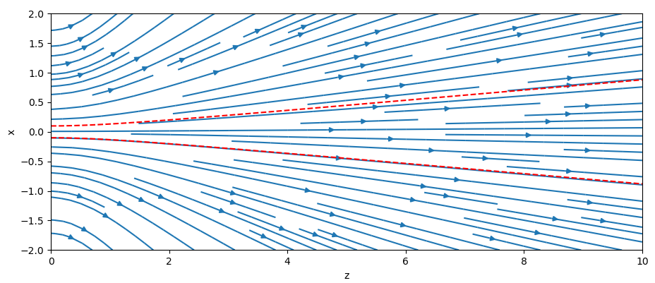

Mono-energetic Particle Beams
=============================

..  autoclass:: cherab.core.beam.node.Beam
   :members:

   The beam direction pattern in XZ-plane for the beam with ``sigma`` = 0.1 m
   and ``divergence_x`` = 5 :math:`^{\circ}`.
